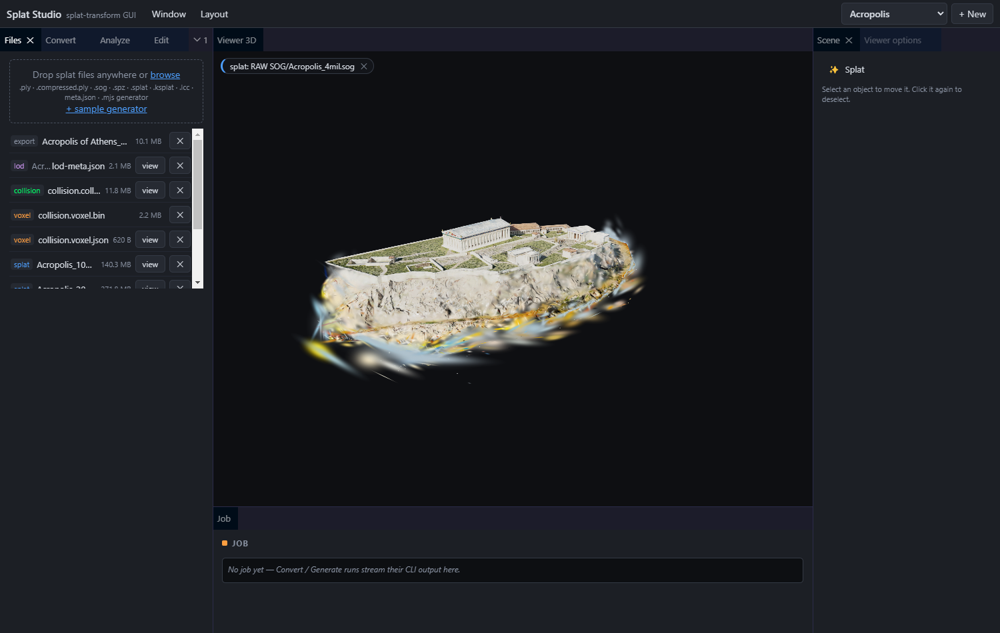
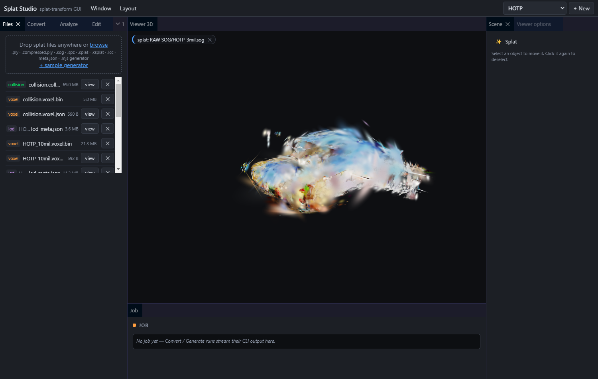

# Splat Studio

A local desktop GUI for [`@playcanvas/splat-transform`](https://github.com/playcanvas/splat-transform):
Gaussian-splat format conversion, SOG bundling, streamed-LOD baking and
collision-mesh generation, with a [PlayCanvas](https://playcanvas.com) 3D viewer —
all in a dockable, Unity/Unreal-style tab editor you can rearrange and save per
workspace.

<!-- versions: the "Built with" line below is kept in sync by the weekly dependency-update routine -->
**Built with [PlayCanvas](https://github.com/playcanvas/engine) `2.20.4` · [@playcanvas/splat-transform](https://github.com/playcanvas/splat-transform) `2.7.1`**

[](LICENSE)




> The dockable editor: panels and the 3D viewport are tabs you can move, resize, float,
> close, and reopen from the **Window** menu — the layout is saved per workspace. Above:
> the Acropolis scan; below: HOTP.



📖 **[User Guide](docs/USER_GUIDE.md)** (illustrated, every feature) ·
⚙️ **[Automation Architecture](docs/AUTOMATION.md)** (how the app keeps itself current) ·
⬇️ **[Download the latest release](https://github.com/CodeByKeegan/splat-studio/releases/latest)**

---

## Contents

- [Features](#features)
- [Download & install](#download--install)
- [Getting started](#getting-started)
- [Usage](#usage)
- [Analyze & procedural generators](#analyze--procedural-generators)
- [Render to image (WebP) & output options](#render-to-image-webp--output-options)
- [Edit: measure-to-scale & set origin](#edit-measure-to-scale--set-origin)
- [How it works](#how-it-works)
- [Notes & caveats](#notes--caveats)
- [HTTP API](#http-api)
- [Built with](#built-with)
- [Contributing](#contributing)
- [AI-assisted development](#ai-assisted-development)
- [License](#license)
- [Support](#support)

## Features

- **Export** splats between formats — `.ply`, `.compressed.ply`, `.sog` (bundled
  and unbundled), `.spz`, and **streamed LOD SOG** for large scenes — with
  spherical-harmonic compression controls.
- **Collision** — voxelize a splat and emit a watertight triangle mesh
  (`.collision.glb`) with indoor / outdoor / object presets.
- **3D viewer** — PlayCanvas renderer with fly/orbit cameras, a scene hierarchy,
  movable gizmos, collision-overlay styles (X-ray / hidden-line / solid+edges),
  voxel-octree display, bounds, and an applyable skybox.
- **Edit from the viewport** — measure-to-scale and set-origin tools that drive
  splat-transform visually; apply a scale directly to a selected splat.
- **Analyze** — gaussian count, extent, NaN/Inf flags and per-column histograms
  as a persistent card. Procedural `.mjs` generators are first-class inputs.
- **Render to WebP** — rasterize a splat to a lossless image (pinhole or 360°
  equirect) with depth-of-field and motion-blur controls.
- **Dockable editor** — every panel and the viewport is a tab you can move,
  float, close, and reopen; layouts are saved per workspace.
- **Self-updating desktop app** — ships as a standalone Windows app (Electron)
  that checks GitHub Releases on launch, then downloads and installs new versions
  in the background (you choose when to restart).

## Download & install

Grab the latest Windows build from the
**[Releases page](https://github.com/CodeByKeegan/splat-studio/releases/latest)** —
no Node install, terminal, or `npm run dev` required. Each release lists the
PlayCanvas and splat-transform versions it was built against, plus a changelog of
what changed.

- **`Splat-Studio-Setup-<version>.exe`** — NSIS installer (per-user, lets you
  choose the install dir, creates Start-menu/desktop shortcuts).
- **`SplatStudio-<version>-portable.exe`** — single self-contained exe; run it
  from anywhere, nothing is installed.

On first run the workspace defaults to `Documents\Splat Studio`; **File → Change
Workspace Folder…** points it at any folder of project subfolders (the choice is
remembered). **File → Open Workspace in Explorer** reveals it on disk.

**Automatic updates:** on launch (and every few hours), the app checks GitHub
Releases. If a newer version exists it offers to **download** it — the download runs
in the background (progress shows on the taskbar icon) and, when ready, it offers to
**restart and install** (or installs automatically the next time you quit). Check any
time via **Help → Check for Updates**. (The NSIS installer self-updates; the portable
exe does not.)

## Getting started

Want to run from source — to develop, or to build the app yourself?

**Prerequisites:** [Node.js](https://nodejs.org) **22+** and npm. Windows is required to
build the desktop app; the dev server itself runs anywhere. A WebGPU-capable GPU unlocks
voxelization, collision, and GPU renders — SOG compression falls back to CPU without one.

**Clone, install, and launch with a synthetic scan** so you see it working end to end:

```bash
git clone https://github.com/CodeByKeegan/splat-studio.git
cd splat-studio
npm install
npm run demo   # writes workspace/demo-room.ply — a synthetic room scan
npm run dev    # API on :5174, UI on http://localhost:5173
```

Open **http://localhost:5173**. `demo-room.ply` is already listed in the **Files** panel —
click **view** to load it into the 3D viewer, then run your first job with
**Convert → SOG (bundled)**. Output streams into the **Job** panel and the new file flashes
in the list.

The workspace defaults to `./workspace`, where each top-level subfolder is a project; point
it elsewhere with the `SPLAT_WORKSPACE` environment variable.

### Build the desktop app

```bash
npm run dist:win     # build + package the NSIS installer and portable exe into release/
npm run pack:dir     # faster: unpacked release/win-unpacked/Splat Studio.exe, no installer
```

(`npm run make-icon` regenerates `build/icon.ico` — committed, only needed if the icon changes.)

### Run the tests

```bash
npm run typecheck          # tsc --noEmit
npm test                   # tests/e2e.mjs — black-box regression suite
SKIP_GPU=1 npm test        # skip the GPU-only checks (collision, WebP render)
```

## Usage

The workspace defaults to `./workspace`, but each **top-level subfolder of the
workspace is a project** (e.g. `HOTP/`, `Acropolis/`). Point the workspace at a
folder of asset folders with the `SPLAT_WORKSPACE` env var (set in `dev.cmd`).
Within a project, sources can be nested (e.g. `RAW SOG/scene_10mil.sog`); the
file list surfaces every source individually but collapses output bundles
(streamed LOD, unbundled SOG) to their `lod-meta.json` / `meta.json` entry
point. Generated outputs always land at the project root.

Then in the browser:

0. **Project picker** (header) — switch projects (filters everything below and
   clears the viewport) or **+ New** to create one. Project scoping is
   per-request, so two windows can sit on different projects at once.
1. **Files** — drop a `.ply` / `.sog` / `.spz` / `.splat` / `.ksplat` file
   anywhere in the window (or use the generated `demo-room.ply`). Click
   **view** to display a splat; **✕** asks twice before deleting. Uploads show
   a progress bar; job outputs flash blue in the list. Panel headers
   collapse/expand on click (state persists), the Job panel stays pinned to
   the bottom of the sidebar, and all form values survive a reload.
2. **Export** — pick an output format. SOG bundling is filename-driven in
   splat-transform: *SOG (bundled)* writes `name.sog`, *SOG (unbundled)* writes
   `name-sog/meta.json` + WebP textures. SH compression iterations apply to both.
   *Streamed LOD SOG* writes `name-lod/lod-meta.json` plus one unbundled-SOG
   chunk folder per LOD level, spatially chunked (`-C` K-gaussians per chunk,
   `-X` meters per chunk). The viewer streams chunks by camera distance — this
   is the format for big scenes in the PlayCanvas engine. Two source modes:
   - *Decimate input automatically* — the input is read once per level,
     GPU-decimated to `keep%^level` of the original and tagged `-l <n>`.
   - *Combine existing files as levels* — for pre-authored detail chains
     (e.g. exports at 20M/10M/4M/2M gaussians): the Input is LOD 0 and each
     added row is the next, lighter level; no decimation is performed.
3. **Collision** — voxelizes the splat (`name.voxel.json`/`.bin`) and emits a
   triangle mesh `name.collision.glb` (`-K smooth|faces`). Presets:
   - *Indoor* — `--voxel-external-fill` seals the room from outside, `--voxel-carve`
     re-opens the walkable interior from the seed.
   - *Outdoor* — `--voxel-floor-fill` closes holes in terrain.
   - *Object* — plain voxelization.

   The **seed position is in splat-transform's voxel space** (Y-up, but rotated
   180° about Y relative to the viewer — splat-transform maps raw splat space
   with `x,y → -x,-y` while viewers rotate about X). The 📷 button takes the
   current camera position and converts it for you (for the demo room, 1 m
   above the floor is `0, 1, 0`).
4. **Viewer** — a top toolbar toggles the camera mode (fly default / orbit) and
   collision style; each item in the **Scene** hierarchy has a visibility button
   (splat / collision / voxels / bounds). Camera: orbit/pan with the mouse, fly
   with WASD. Generated collision results auto-load when the job finishes (toggle
   per panel). Each loaded layer shows a HUD chip; the chip's **✕ unloads** that
   layer (frees its GPU memory — distinct from the visibility toggles), and
   **Clear viewport** unloads all three at once. Selecting the render camera or a
   capsule collider in the hierarchy raises a movable (and, for the camera,
   rotatable) gizmo; deselecting hides it. **Collision style** offers X-ray
   wireframe (small meshes), hidden-line wireframe (a depth-only prepass culls
   hidden edges — dense meshes auto-switch to this above 100K triangles), and
   *Solid + edges* (lit translucent surface — the mode for verifying placement
   against the splat and flying inside carved interiors). Visual settings (wire
   and voxel colours/opacity, plus dark-mode / font / language placeholders) live
   in a separate **Settings** window (⚙ in the toolbar).
   Clicking **view** on a `.voxel.json` renders the sparse voxel octree as
   hardware-instanced translucent boxes (solid octree regions render as one
   merged box; display is capped at 1.5 M boxes — regenerate with a coarser
   voxel size if truncated). The `.voxel.bin` format is parsed client-side
   ([client/src/voxel-parser.js](client/src/voxel-parser.js), format
   documented in its header; validated against real output by
   `node scripts/test-voxel-parse.mjs <name>`).

## Analyze & procedural generators

- **Analyze** panel — pick any splat and **Summarize stats** (`-m/--summary`,
  `null` output, writes nothing). Results render as a **persistent card**:
  headline tiles (gaussian count, X×Y×Z extent, a NaN/Inf flag) over a per-column
  table with histograms, with a **copy** button for the raw Markdown. The card
  survives later jobs (unlike the transient Job log).
- **`.mjs` generators** — a JavaScript module that procedurally synthesizes a
  splat, run from the **Generate** tab (and usable as an Export/Analyze input).
  Drop one in or click **+ sample generator** (writes
  [`examples/gen-grid.mjs`](examples/gen-grid.mjs)), then pick it in the Generate
  tab. A generator must `export` a `Generator` class with a
  static `create(params)` returning `{ count, columnNames, getRow(index, row) }`;
  column values are raw (log-space scale, logit opacity, SH-DC colour). Local-only.
  - **Generator params** (`-p/--params`): pass `width=16,height=16,scale=4`. If
    the generator advertises a static `params` schema (`[{name,label,min,max,step,
    default}]`), the GUI renders **live sliders** instead of the freeform field.
  - **✨ Generate & view** runs the generator and loads the result straight into
    the 3D viewer in one click; releasing a slider regenerates and re-previews.
- **Bounds** (Viewer panel) — overlay the loaded splat's axis-aligned bounding
  box; its extent and any floaters/outliers (which stretch the box) show at a
  glance.

## Render to image (WebP) & output options

- **WebP render** — use the Render tab to rasterize
  the splat to a lossless `.webp` via the GPU (`--camera`/`--look-at`/`--fov`/
  `--resolution`/`--background`). **📷 from viewer** seeds the camera from the 3D
  view. **Projection** switches pinhole ↔ equirectangular 360° panorama. **Depth
  of field** (`--f-stop`/`--focus-distance`, pinhole only) and **motion blur**
  (`--camera-end`/`--shutter`/`--motion-samples`) are exposed too.
- **Device** dropdown — choose the GPU adapter (listed via `-L/--list-gpus`) or
  CPU (`-g`). **Verbose** adds `--verbose --mem` diagnostics to the Job log.
- **HTML viewer** output gains **Unbundled** (`-U`, separate files) and a
  **Viewer settings** JSON (`-E`). An **.lcc** input gains **LOD levels** (`-O`).

## Edit: measure-to-scale & set origin

The **Edit** panel drives splat-transform from the viewport — splats have no
inherent scale or origin, so these fix both visually:

- **Measure → scale** — turn on *Measure mode* and **click on the splat surface**
  to drop two markers (A green, B orange) at the ends of a feature whose real
  size you know (a doorway, a 1 m scale bar); each marker can then be dragged to
  fine-tune. The live readout shows the A–B distance; type the real length and
  **Apply scale** writes a correctly-scaled splat (`-s/--scale`) that auto-loads.
- **Apply scale directly** — with a splat selected, type a scale factor and apply
  it without measuring.
- **Set origin** — turn on *Pick origin*, place the marker at the point that
  should be `(0,0,0)`, and **Set as origin** recenters the splat
  (`-t/--translate`) — handy before placing it in a scene.

Both write a new splat and load it straight into the viewer.

## How it works

- **Backend** — Express server (`server/`) that spawns the `splat-transform` CLI
  (`--no-tty`) as job subprocesses and serves the `workspace/` directory.
  The CLI brings its own native WebGPU (Dawn) device for GPU stages.
- **Frontend** — Vite + TypeScript (`client/`), PlayCanvas engine 2.x for rendering.
  The splat loads via the `gsplat` asset type (`.ply`, `.compressed.ply`, `.sog`,
  unbundled `meta.json`); the collision `.collision.glb` loads via the `container`
  asset type and is drawn with `RENDERSTYLE_WIREFRAME` on the Immediate layer.
- **Desktop app** — the Electron main process
  ([electron/main.mjs](electron/main.mjs)) picks a free port, launches the Express
  server (the Electron binary runs as Node via `ELECTRON_RUN_AS_NODE`, so it can
  still spawn the native-WebGPU `splat-transform` CLI), waits for it to come up,
  then opens the UI in a Chromium window.
- **Automation** — every push to `main` builds and publishes a Windows release via
  GitHub Actions, and a weekly routine tracks new splat-transform / PlayCanvas
  releases and wires new CLI flags into the GUI. See
  [docs/AUTOMATION.md](docs/AUTOMATION.md).

## Notes & caveats

- **GPU required** for voxelization/collision and `--filter-cluster` (the CLI uses
  native WebGPU). SOG compression can fall back to CPU ("CPU only" checkbox,
  5–10× slower).
- The API binds to `127.0.0.1` only (it can write/delete files and spawn
  processes). A job is killed only after **10 minutes with no output** (an idle
  watchdog, not a wall-clock cap — a streamed-LOD bake on a large scene runs
  well over an hour while emitting a chunk every few seconds, and must not be
  reaped). Override with `SPLAT_JOB_IDLE_TIMEOUT_MS`. A running job can be
  cancelled from the job panel. Uploads are capped at 8 GB and written via temp
  file + rename so aborted uploads leave nothing behind.
- Export jobs never overwrite a pre-existing file the app didn't generate —
  outputs divert to a `-converted` name instead (e.g. converting
  `room.compressed.ply` back to PLY won't clobber your original `room.ply`).
- The splat renders with the conventional 180° X flip (PLY data is Y-down);
  splat-transform's collision GLB is Y-up via a 180° Z rotation instead, so the
  viewer applies a 180° Y rotation to it — verified with an asymmetric test
  blob (`scripts/axis-test.mjs`). *Flip collision* removes that rotation for
  meshes from tools that already match viewer space.
- Workspace files live in `workspace/` (gitignored). The job log panel shows the
  exact CLI invocation for reproducing outside the GUI.

## HTTP API

| Route | Purpose |
| --- | --- |
| `GET /api/files` | list workspace files |
| `POST /api/upload?name=` | upload (raw body stream) |
| `DELETE /api/files/:name` | delete file (folder for unbundled SOG) |
| `POST /api/convert` | `{ input, format, options }` → `{ jobId }` |
| `POST /api/collision` | `{ input, options }` → `{ jobId }` |
| `GET /api/jobs/:id` | job status, log, outputs |
| `POST /api/jobs/:id/cancel` | kill a running job |
| `GET /files/*` | static workspace files |

## MCP server (AI agent control)

Splat Studio ships an [MCP](https://modelcontextprotocol.io) server (`mcp-server/`) that lets an AI
agent drive **the headless splat-transform pipeline** (convert, LOD, render, collision, trim, analyze —
always available) and, with your consent, **the live editor** (camera, panels, gizmos, tools). It connects
to the running app over loopback and never launches it.

Point an MCP client (Claude Desktop, Claude Code, etc.) at the server:

```json
{
  "mcpServers": {
    "splat-studio": {
      "command": "node",
      "args": ["<path-to>/splat-studio/mcp-server/index.mjs"]
    }
  }
}
```

Start Splat Studio first. Headless tools work immediately. To let an agent control the **live** editor,
turn on **Settings → Agent control (MCP)** — it's off by default, loopback-only, and revocable instantly.
28 tools total.

📖 **Step-by-step install + client setup (Claude Desktop / Claude Code), the full tool list, and
troubleshooting: [docs/MCP_SETUP.md](docs/MCP_SETUP.md).** Workflow tutorials — from "convert this
for the web" to 360° panoramas and real-world scaling: [docs/MCP_WORKFLOWS.md](docs/MCP_WORKFLOWS.md).
For the agent-facing playbooks, see the `splat-studio-mcp` and `splat-studio-workflows` skills.

## Built with

- **[PlayCanvas engine](https://github.com/playcanvas/engine)** ([playcanvas.com](https://playcanvas.com)) — WebGL/WebGPU rendering and Gaussian-splat support.
- **[@playcanvas/splat-transform](https://github.com/playcanvas/splat-transform)** — the splat conversion / SOG / collision CLI this GUI drives.
- **[Electron](https://www.electronjs.org/)** + **[electron-builder](https://www.electron.build/)** — the standalone desktop app and Windows installers.
- **[Vite](https://vitejs.dev/)** + **[TypeScript](https://www.typescriptlang.org/)** — the frontend build.
- **[Express](https://expressjs.com/)** — the local job server.
- **[dockview](https://dockview.dev/)** — the dockable tab/window editor.

## Contributing

Contributions are welcome — issues and pull requests both.

1. Fork and create a branch off `main`.
2. `npm install`, then make your change. Keep it focused (one feature/fix per PR).
3. Before opening a PR, run the checks:
   ```bash
   npm run typecheck
   npm test            # tests/e2e.mjs regression suite
   ```
   Both must pass. UI/viewer changes should be verified against a running
   `npm run dev`.
4. Match the existing style: brief, what-not-why code comments; new CLI flags get
   a control + tooltip in the GUI and a `check(...)` in the e2e suite (see the
   `.claude/skills/` routines for how features and dependency bumps are wired).

Open an [issue](https://github.com/CodeByKeegan/splat-studio/issues) first if you
want to discuss a larger change.

## AI-assisted development

Splat Studio is developed with [Claude Code](https://claude.com/claude-code).
Commits and pull requests carry standard `Co-Authored-By` attribution, and PRs
opened autonomously by the weekly dependency-update routine say so in their
description. All changes — human- or agent-authored — are reviewed before merge
and held to the same checks described in [Contributing](#contributing).

## License

Released under the [Apache License 2.0](LICENSE) © 2026 CodeByKeegan — see also
[NOTICE](NOTICE).

## Support

If Splat Studio is useful to you, you can support its development:

☕ **[Buy me a coffee on Ko-fi](https://ko-fi.com/codebykeegan)**
