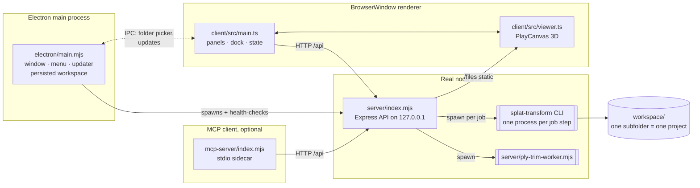
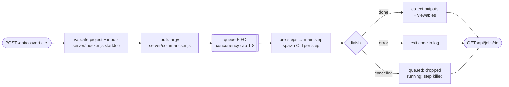
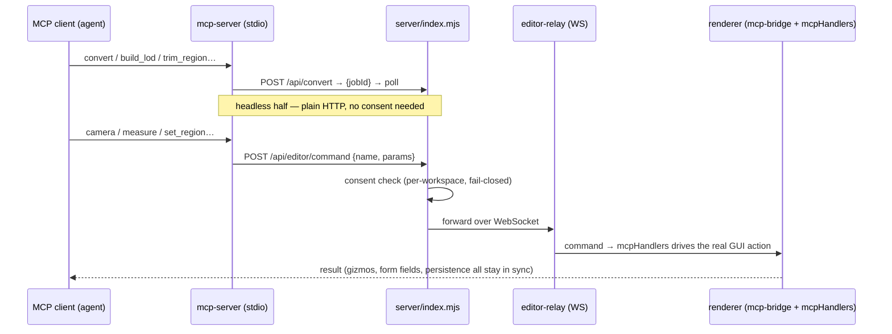

# Code architecture

How Splat Studio is put together: the processes, the modules, and the paths a
request takes through them. For how the project *maintains itself* (release
pipeline, dependency updates, doc regeneration), see [AUTOMATION.md](AUTOMATION.md).

## The process model

Splat Studio is three processes in the desktop app — four when an AI agent is
connected via MCP:

- **Electron main** ([electron/main.mjs](https://github.com/CodeByKeegan/splat-studio/blob/dev/electron/main.mjs))
  picks a free port, spawns the server, waits for `/api/health`, then opens the
  window on the server's URL. The server (and the CLI it spawns) must run under a
  **real Node binary** — the CLI's native WebGPU/Dawn device crashes inside the
  Electron binary, so packaged builds bundle `node.exe`. The window runs with
  `contextIsolation`, `sandbox`, and no `nodeIntegration`; a minimal preload
  ([electron/preload.cjs](https://github.com/CodeByKeegan/splat-studio/blob/dev/electron/preload.cjs))
  exposes only the folder picker, workspace persistence, and update controls.
- **The server** is the single authority over the workspace and all jobs. It
  binds `127.0.0.1` only and validates `Host`/`Origin` on every request (CSRF /
  DNS-rebinding defense) — see [SECURITY.md](https://github.com/CodeByKeegan/splat-studio/blob/dev/SECURITY.md)
  for the trust model.
- **The renderer** is a Vite/TypeScript app; in dev it runs on the Vite dev
  server with `/api`, `/files`, and the editor WebSocket proxied to Express, so
  the same code paths hold with or without Electron.
- **The MCP server** is a thin stdio sidecar an MCP client (Claude Desktop,
  Claude Code, …) launches itself; it speaks only HTTP to the loopback API and
  never starts the app.

## Module map

| Area | Module | Responsibility |
| --- | --- | --- |
| Server | [server/index.mjs](https://github.com/CodeByKeegan/splat-studio/blob/dev/server/index.mjs) | Routes, path safety, workspace/projects/files, uploads, cheap header counts + cached `--stats`, layout + location groups, editor relay wiring |
| Server | [server/commands.mjs](https://github.com/CodeByKeegan/splat-studio/blob/dev/server/commands.mjs) | Payload → validated CLI argv for convert / LOD / collision / summary / trim |
| Server | [server/jobs.mjs](https://github.com/CodeByKeegan/splat-studio/blob/dev/server/jobs.mjs) | Job queue (FIFO, concurrency cap), subprocess runner, idle watchdog, cancel, log cap |
| Server | [server/ply-trim.mjs](https://github.com/CodeByKeegan/splat-studio/blob/dev/server/ply-trim.mjs) + worker | Windowed in-process PLY region trim (no CLI, no GPU) |
| Server | [server/editor-relay.mjs](https://github.com/CodeByKeegan/splat-studio/blob/dev/server/editor-relay.mjs) | WebSocket relay between MCP editor commands and the running GUI |
| Server | [server/mcp-config.mjs](https://github.com/CodeByKeegan/splat-studio/blob/dev/server/mcp-config.mjs) | Per-workspace, fail-closed editor-control consent |
| Client | [client/src/main.ts](https://github.com/CodeByKeegan/splat-studio/blob/dev/client/src/main.ts) | Every panel, dockable layout, app state, jobs UI, undo/redo, MCP command handlers |
| Client | [client/src/viewer.ts](https://github.com/CodeByKeegan/splat-studio/blob/dev/client/src/viewer.ts) | `SplatViewer` — PlayCanvas scene: splat/collision/voxel layers, cameras, gizmos, measure + region tools |
| Client | [client/src/api.ts](https://github.com/CodeByKeegan/splat-studio/blob/dev/client/src/api.ts) | Typed fetch client for the whole HTTP API |
| Client | [client/src/mcp-bridge.ts](https://github.com/CodeByKeegan/splat-studio/blob/dev/client/src/mcp-bridge.ts) | Registers the GUI as "the editor" on the relay WebSocket |
| Client | [client/src/theme.ts](https://github.com/CodeByKeegan/splat-studio/blob/dev/client/src/theme.ts) / [voxel-parser.js](https://github.com/CodeByKeegan/splat-studio/blob/dev/client/src/voxel-parser.js) | Theme tokens + editor · sparse voxel-octree binary parser |
| Desktop | [electron/main.mjs](https://github.com/CodeByKeegan/splat-studio/blob/dev/electron/main.mjs) / [updates.mjs](https://github.com/CodeByKeegan/splat-studio/blob/dev/electron/updates.mjs) / [preload.cjs](https://github.com/CodeByKeegan/splat-studio/blob/dev/electron/preload.cjs) | Window/menu/lifecycle · electron-updater channels + status · IPC bridge |
| MCP | [mcp-server/](https://github.com/CodeByKeegan/splat-studio/tree/dev/mcp-server) | `index.mjs` entry; `http.mjs` API client; `errors.mjs` closed error set; `tools/` = `files` · `analysis` · `convert` · `editor` · `advisor` · `resources` · `prompts` |
| Tests | [tests/e2e.mjs](https://github.com/CodeByKeegan/splat-studio/blob/dev/tests/e2e.mjs) / [tests/mcp-e2e.mjs](https://github.com/CodeByKeegan/splat-studio/blob/dev/tests/mcp-e2e.mjs) | Black-box suites over the HTTP API / the MCP tool surface (with a mock editor) |

## The job pipeline

Every heavy operation — convert, LOD bake, render, collision, summary, trim — is
a **job**: submitted over HTTP, queued FIFO, run as a subprocess, and polled.

Key properties:

- **Queue + concurrency.** Jobs start `queued` and run FIFO up to a cap
  (default 1 — one GPU; `SPLAT_JOB_CONCURRENCY` or the Jobs panel raises it,
  clamped 1–8). Terminal states are `done`, `error`, and `cancelled`.
- **Multi-step jobs.** A decimate-mode LOD bake pre-decimates each level to a
  temp `.ply` (its own CLI process per level), then combines them in the main
  step; temps are cleaned on every exit path.
- **Idle watchdog, not a wall clock.** A job is killed only after 10 minutes
  with *no output* — a multi-hour LOD bake that keeps printing progress is never
  reaped.
- **Overwrite protection.** Outputs never clobber the input or any pre-existing
  file the app didn't generate — they divert to a `-converted` name instead.
- **Analysis without jobs.** The file listing reads gaussian counts straight
  from format headers (PLY header, SOG/ZIP central directory, SPZ header) with
  ranged reads and decompression caps; full `--stats` runs are cached per
  `(path, mtime)`.

## The MCP control plane

The MCP surface has two halves — headless (always available) and live-editor
(consent-gated):

Consent is stored per workspace, is **off by default**, and resets to off on
every workspace switch. Editor handlers drive the same code paths as the human
UI, so an agent's edits are indistinguishable from clicks. Setup:
[MCP_SETUP.md](MCP_SETUP.md); recipes: [MCP_WORKFLOWS.md](MCP_WORKFLOWS.md).

## Coordinate frames

Three frames meet in the viewer, and every tool description states which one it
speaks:

| Frame | Used by | From viewer coords |
| --- | --- | --- |
| Viewer world | camera, viewport clicks, measure | — |
| Splat (CLI) frame | `-B`/`-S` filters, trim regions, render cameras, translate/scale | `[x, y, z] → [x, −y, −z]` |
| Voxel space | collision seed point / carve capsule | `[x, y, z] → [−x, y, −z]` |

The PLY trim path bakes the same rotation the CLI bakes before its filters run,
so a GUI region trims exactly what `--filter-box` would.

## Testing

Both suites are **black-box**: they boot the real server on a throwaway
workspace seeded with a synthetic splat and assert on actual outputs.

- `npm test` ([tests/e2e.mjs](https://github.com/CodeByKeegan/splat-studio/blob/dev/tests/e2e.mjs)) drives every
  route and CLI flag over HTTP — formats, LOD modes + build recipes, generators,
  trim, groups, queue/concurrency semantics, and the safety rails (path
  traversal, decompression bombs, truncated inputs). `SKIP_GPU=1` skips the
  GPU-only checks (collision, WebP render), which is what CI runs.
- `npm run test:mcp` ([tests/mcp-e2e.mjs](https://github.com/CodeByKeegan/splat-studio/blob/dev/tests/mcp-e2e.mjs))
  exercises the MCP tool surface end-to-end, including the consent gate and the
  editor relay against a mock editor.

Every new CLI flag or route is expected to land with a `check(...)` in the e2e
suite — see [CONTRIBUTING.md](https://github.com/CodeByKeegan/splat-studio/blob/dev/CONTRIBUTING.md).
