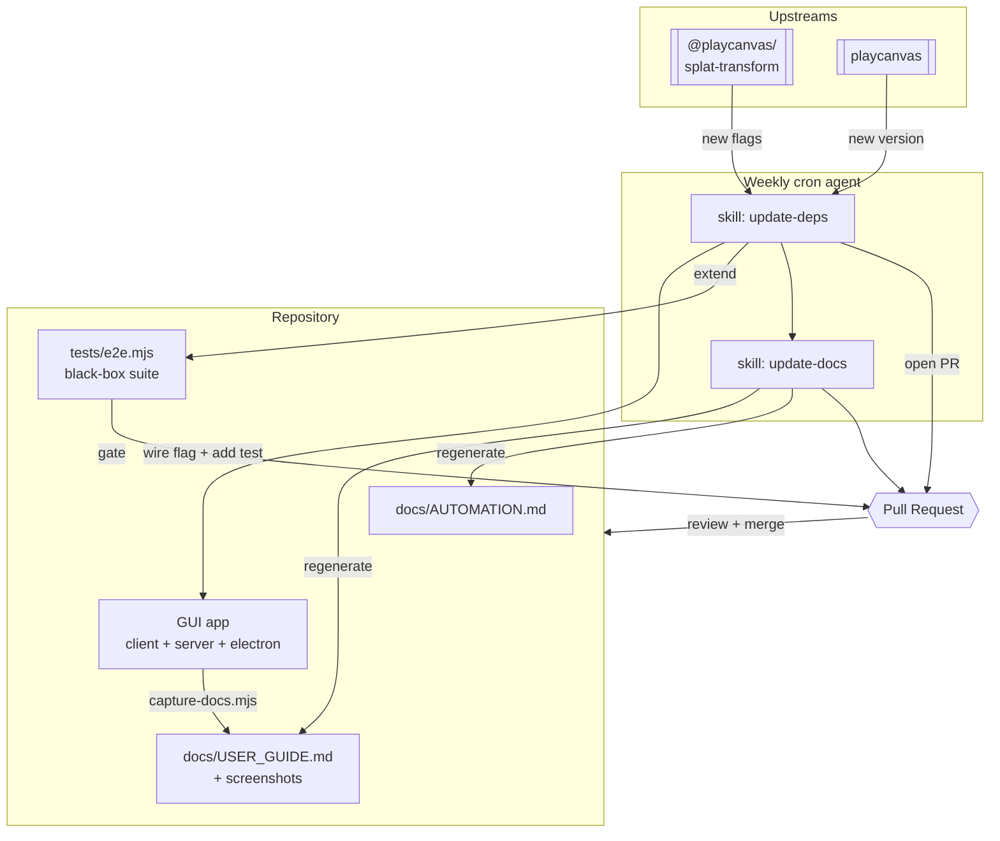
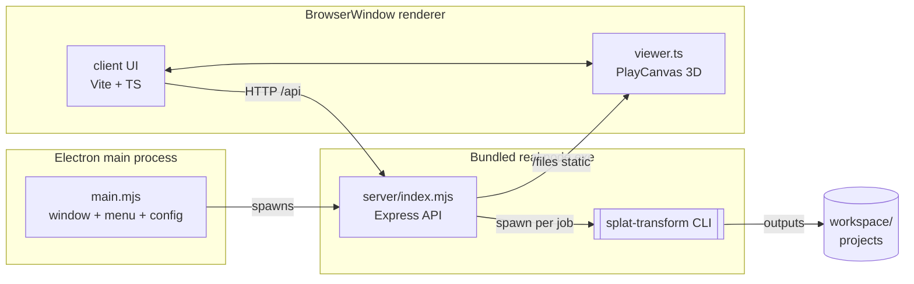
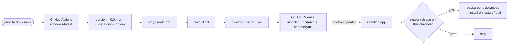
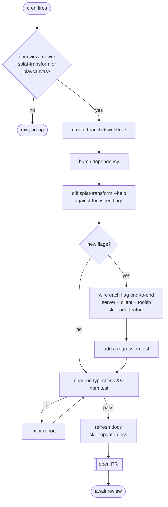
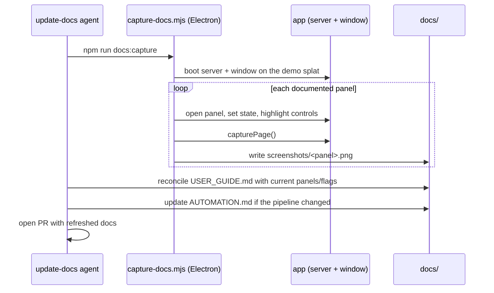

# Splat Studio — Automation Architecture

Splat Studio maintains itself. It tracks its two upstreams
(`@playcanvas/splat-transform` and `playcanvas`), wires any new CLI capability into
the GUI, keeps a black-box regression suite green, and regenerates its own
documentation — all gated behind a reviewable pull request.

This document explains how those pieces fit together.

## The big picture

Everything funnels into a **PR**: nothing reaches `main` without passing the
regression suite and a human review.

## Application architecture

The app the automation maintains is a standalone Electron desktop app. The one
hard constraint shapes the whole design: the `splat-transform` CLI's native WebGPU
(Dawn) device **segfaults inside the Electron binary**, so the CLI must run under a
real `node.exe`, never under Electron.

- **Electron main** owns the window, menu, and persisted workspace; it spawns the
  server under the bundled Node and points the window at it.
- **Server** is a thin Express layer: it lists projects/files, and runs each GUI
  action as one background job — usually a `splat-transform` CLI run, streaming the
  command + output back; the region-trim (`server/ply-trim-worker.mjs`) runs as a Node
  worker, since `-B`/`-S` can only crop, not remove inside a region. It works on any
  single-file splat: non-PLY inputs are first decompressed to a temp PLY via the CLI,
  then trimmed (output is always `.ply`).
- **Renderer** is the Vite/TypeScript UI plus the PlayCanvas viewport (`viewer.ts`),
  which renders splats, collision wireframes, voxels, gizmos, the measure tools, and a
  render-to-texture camera preview. The shell is a dockable tab editor (dockview-core);
  panels + the viewport are tabs, with the layout persisted per workspace via
  `/api/layout`.

## The release pipeline

Every push ships a build. `.github/workflows/release.yml` runs on `windows-latest`
for both branches: a push to `dev` publishes a **beta** pre-release
(`0.0.<run>-beta.<run>`, `beta.yml`), promoting `dev` to `main` publishes a
**stable** release (`0.0.<run>`, `latest.yml`).

The installed app checks GitHub Releases on launch (and via **Help → Check for
Updates…**) through electron-updater; a newer version on the selected channel
downloads in the background and installs when the user restarts (or on quit).
The channel (stable / beta) is switchable in **Settings → Updates**. The
repo's `package.json` stays at version `0.0.0` — CI stamps the real version at
build time, so a from-source build never semver-outranks a published release.

## The dependency-update loop

A scheduled agent runs the `splat-studio-update-deps` skill on a cadence (weekly).
Each run is self-limiting — if nothing upstream changed, it exits in seconds.

New upstream capability therefore appears in the GUI automatically, but only lands
after the suite passes and a human merges the PR.

## The documentation-refresh loop

Documentation is treated as a build artifact, not hand-maintained prose that rots.
The `splat-studio-update-docs` skill regenerates it whenever the app changes — it's
invoked at the end of every dependency-update run, and can be run on its own.

`scripts/capture-docs.mjs` runs the **real** app in an Electron window against the
synthetic `demo-room` splat, so the screenshots are reproducible on any machine and
show the actual rendered viewport — not mockups. Re-running overwrites the PNGs in
place, so a docs PR is a clean diff of only what visually changed.

## The skill bank — `.claude/skills/`

| Skill | Responsibility |
| --- | --- |
| `splat-studio-control` | How to drive the app: server, project model, the full HTTP API for every function. |
| `splat-studio-mcp` | The MCP server contract: tools, consent, jobs, coordinate frames, extending the surface. |
| `splat-studio-workflows` | End-to-end MCP recipes (web optimization, collision, renders, cleanup, scaling, batch). |
| `splat-studio-test` | Run and extend the regression suite. |
| `splat-studio-add-feature` | Wire a new CLI flag (or viewer feature) into the GUI end-to-end, with a test. |
| `splat-studio-update-deps` | The autonomous routine: detect an upstream update, bump it, wire new flags, run tests, open a PR. |
| `splat-studio-update-docs` | Regenerate the user guide (text + screenshots) and this architecture doc after any change. |

## The regression suite — `tests/e2e.mjs`

Black-box end-to-end: boots the server on a throwaway workspace seeded with a
synthetic splat + the sample generator, drives **every** server function over the
HTTP API, and asserts on the outputs. Run with `npm test` (add `SKIP_GPU=1` on
machines without a GPU). This is the gate every change and dependency bump passes
through before its PR can merge.

## Conventions

- **Branch + PR per change** (worktrees preferred); the suite must be green.
- Commits authored **CodeByKeegan** with Claude Code co-authorship (see the README's AI-assisted development section).
- Every GUI control's tooltip names the CLI flag it maps to, in parentheses.
- The maintainer tracks CLI-flag coverage on a task board (one task per flag);
  to propose or discuss features, [open a GitHub issue](https://github.com/CodeByKeegan/splat-studio/issues).
