# Splat Studio — User Guide

A complete walkthrough of everything Splat Studio can do. Splat Studio is a local
desktop GUI for [`@playcanvas/splat-transform`](https://github.com/playcanvas/splat-transform):
convert gaussian-splat formats, bundle SOG, render images, generate collision
meshes, and edit splats — all with a live PlayCanvas 3D viewport.

> The screenshots below are generated automatically from the running app against the
> built-in **demo room** splat (`npm run docs:capture`), so they always match the
> current UI. The highlight boxes mark the controls each step refers to.

## Contents
- [The interface](#the-interface)
- [Projects & files](#projects--files)
- [Export: output formats & filters](#export-output-formats--filters)
- [Generate: procedural .mjs generators](#generate-procedural-mjs-generators)
  - [Filters](#filters)
- [LOD: streamed multi-LOD](#lod-streamed-multi-lod)
- [Render: WebP image](#render-webp-image)
- [Analyze: summary statistics](#analyze-summary-statistics)
- [Edit: transform, measure & region](#edit-transform-measure--region)
  - [Transform](#transform)
  - [Region (crop / carve)](#region-crop--carve)
- [Collision: voxels & mesh](#collision-voxels--mesh)
- [Viewport toolbar & Settings](#viewport-toolbar--settings)
- [Scene hierarchy](#scene-hierarchy)
- [Camera view](#camera-view)
- [The 3D viewport](#the-3d-viewport)
- [Coordinate notes](#coordinate-notes)
- [Updates](#updates)

---

## The interface

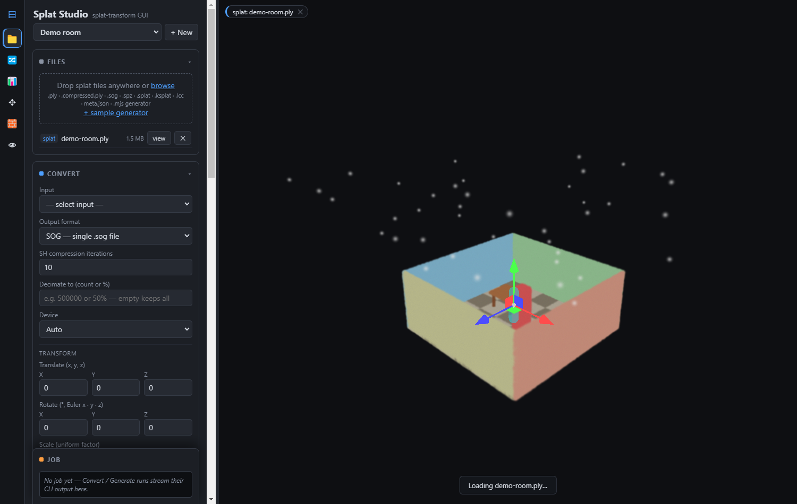

Splat Studio is a **dockable tab editor** (think Unity/Unreal). Every panel and the
3D viewport is a tab you can **drag to re-dock, resize, float, close, and reopen**.

- **Top menu bar** — the app title, the **Window** and **Layout** menus, and the
  project picker.
- **Dock** — the default layout puts the panel tabs (Files, Export, Generate, LOD, Render,
  Analyze, Edit, Collision) on the left, the **3D viewport** in the center, the **Job** panel
  (live `splat-transform` output) below it, and **Scene** on the right. Drag any tab
  to rearrange; drag a tab out to float it in its own window. **Settings** opens as
  its own dialog (⚙ in the viewport toolbar, or **Window ▸ Settings…**).
- **Viewport** — the live 3D view, with a [toolbar](#viewport-toolbar--settings) along
  its top. The default camera is **fly** (mouse-look + WASD); scroll zooms (Shift
  fast, Ctrl slow). Switch to orbit from the toolbar.

Every control has a tooltip — hover to see what it does and which CLI flag it maps to.

### Top menu

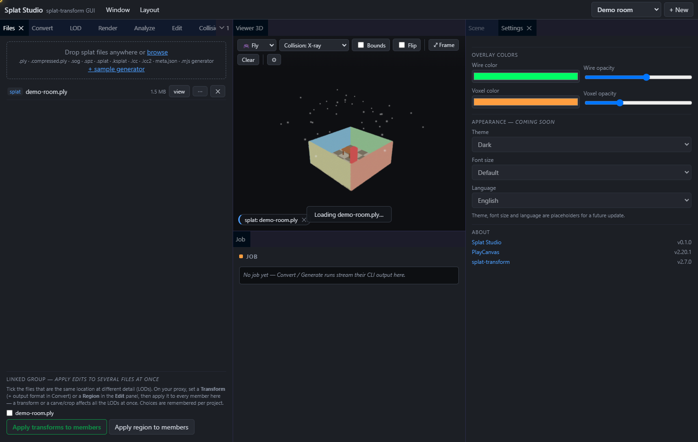

- **Edit** — **Undo** (`Ctrl+Z`) and **Redo** (`Ctrl+Y` or `Ctrl+Shift+Z`) step through
  recent changes: panel settings, gizmo moves (a single drag is one step), layer
  visibility, and which splat is loaded. Native text-field undo still works while you're
  typing in a field. Running a job or deleting a file is **not** undoable (those write to
  disk), and the history resets when you switch projects.
- **Window** — lists every panel with a checkmark for the ones that are open. Click to
  **reopen a closed panel** or close an open one. (The 3D **Viewer** and **Job** tabs
  can't be closed.) **Settings…** at the bottom opens the settings dialog.
- **Layout** — **Reset to default** restores the standard arrangement; **Save layout**
  checkpoints the current one. The layout is **saved per workspace**, so each workspace
  remembers its own arrangement.

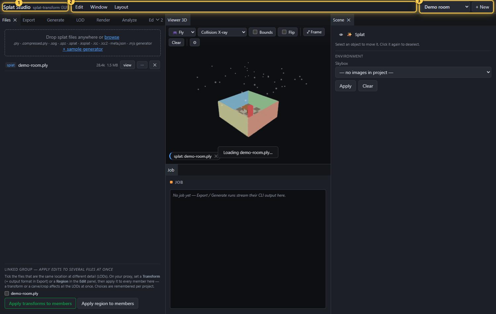

The top bar holds (1) the app title, (2) the menus, and (3) the project picker.

---

## Projects & files

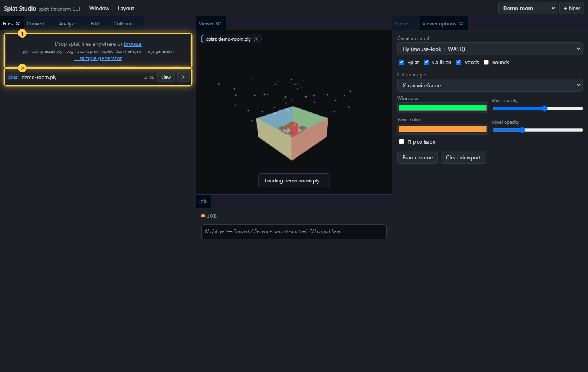

A **project** is a folder in your workspace; the dropdown in the top bar
switches between them, and **+ New** creates one. Everything is scoped to the
active project.

To add splats:

1. **Drop** files anywhere in the window, or click **browse**. Supported inputs:
   `.ply`, `.compressed.ply`, `.sog`, `.spz`, `.splat`, `.ksplat`, `.lcc`, `.lcc2`,
   `meta.json`, and `.mjs` generators.
2. The **file list** shows every source in the project, one row per file:
   **checkbox · ▸ chevron · 👁 eye · kind tag · name · gaussian count · size · ⋯ · ✕**.

   - The **gaussian count** is read straight from the file's own metadata — instant, no
     analysis run. Hover it for the exact number; on LOD bundles it breaks down per
     level. (Formats that don't store a readable count — `.ksplat`, `.lcc` — omit it.)
   - The **👁 eye** shows or hides the file in the viewport. Several splats (and streamed
     LOD bundles) can be shown at once: a bright eye is visible, a dim 🙈 is loaded but
     hidden (re-show is instant), a faint eye is not loaded yet. The most recently shown
     splat is the **active** one — the Edit / Analyze / Collision panels and the viewport
     HUD chip target it. Collision meshes and voxel octrees each have a single overlay
     slot, so showing one replaces the previous overlay.
   - The **▸ chevron** (splat and LOD rows) expands an inline **details card**: exact
     gaussian count, size, modified date, kind, and full path. On streamed-LOD bundles
     the card also shows the **build recipe** — a per-level table (level, source file,
     keep %, gaussian count; the environment shell is flagged), the effective settings,
     and the bake date + generator versions — read from the bundle's `build-meta.json`
     (bundles baked before that file existed report "No build recipe" and list the
     per-level counts instead).
   - The **checkbox** selects the row for bulk actions; **✕** (click twice) deletes the
     file.
3. The **bar above the list** holds the list-wide controls: a **select-all** checkbox
   (indeterminate when only some rows are ticked), **Show all** and **Hide all** (showing
   more than 20M new gaussians asks first — click again to confirm), and, while any rows
   are selected, the **bulk actions**: **Show selected** / **Hide selected** (same rules
   as Show/Hide all, selected files only), **Add to linked group** (ticks the selected
   splats in the Linked group below and saves), and **Delete selected** (click twice to
   confirm; removes every selected file).
4. **Right-click any file** — or click its **⋯** button — for an actions menu of
   everything you can do with that file. The menu adapts to the file's type:

   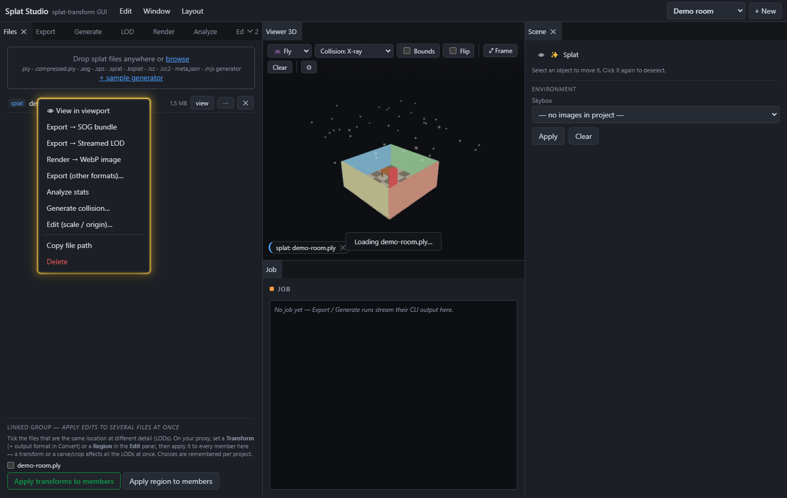

   - **View in viewport** and **Details** (toggles the row's details card).
   - **Export → SOG bundle** / **Export as…** — jumps to the Export
     panel with the file selected and the format preset; **Export → Streamed LOD**
     jumps to the LOD panel.
   - **Generate / Regenerate collision…** — jumps to the Collision panel (the label
     tells you whether a collision mesh already sits next to the file).
   - **Analyze stats** — runs the summary and shows the stats card.
   - **Edit (scale / origin)…**, **Generate & view** (`.mjs` generators),
     **Copy file path**, and **Delete**.
5. **+ sample generator** drops a ready-to-run `.mjs` scene generator into the
   project — run it from the [Generate tab](#generate-procedural-mjs-generators).

> **Linked group — edit a proxy, apply to every LOD:** the **Linked group** section at
> the bottom of the Files panel lets you tick the files that are the same location at
> different detail (its LODs). Edit the proxy once, then fan that one edit across the
> whole ladder so it stays consistent. Two actions:
>
> - **Apply transforms to members** — set the **Transform** in the **Edit** panel (plus
>   a splat output format in **Export**) on your proxy, then click this; every ticked
>   member is converted in turn with the same transform/filter settings.
> - **Apply region to members** — set a **Region** (carve or crop) in the **Edit** panel
>   on your proxy, then click this; the same removal or crop is applied to every ticked
>   member, so a region edit on the proxy propagates across all the LODs.
>
> Both run as sequential jobs. Choices are remembered per project; a heads-up appears
> if the members' extents differ a lot (they may not be the same location).
>
> 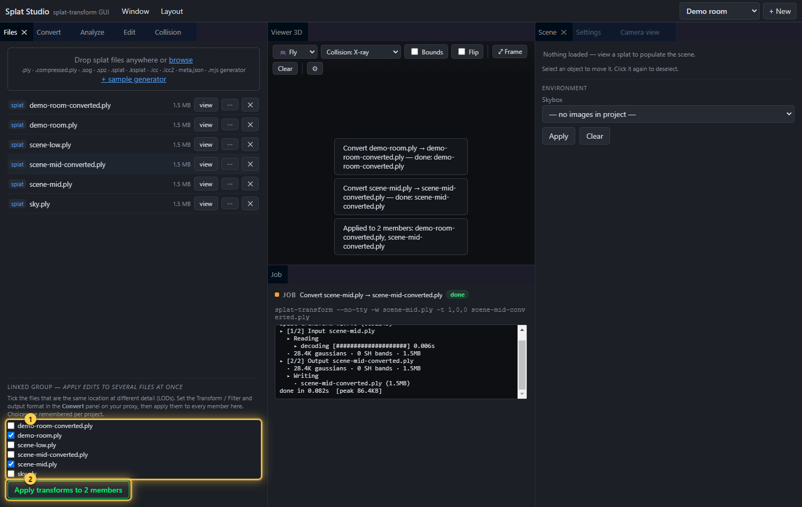
>
> 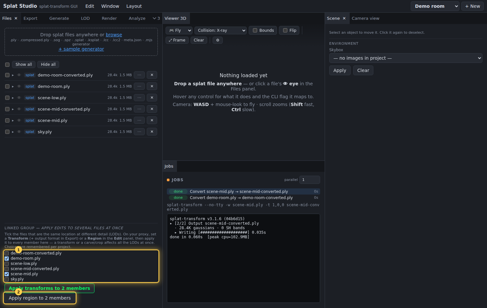

---

## Export: output formats & filters

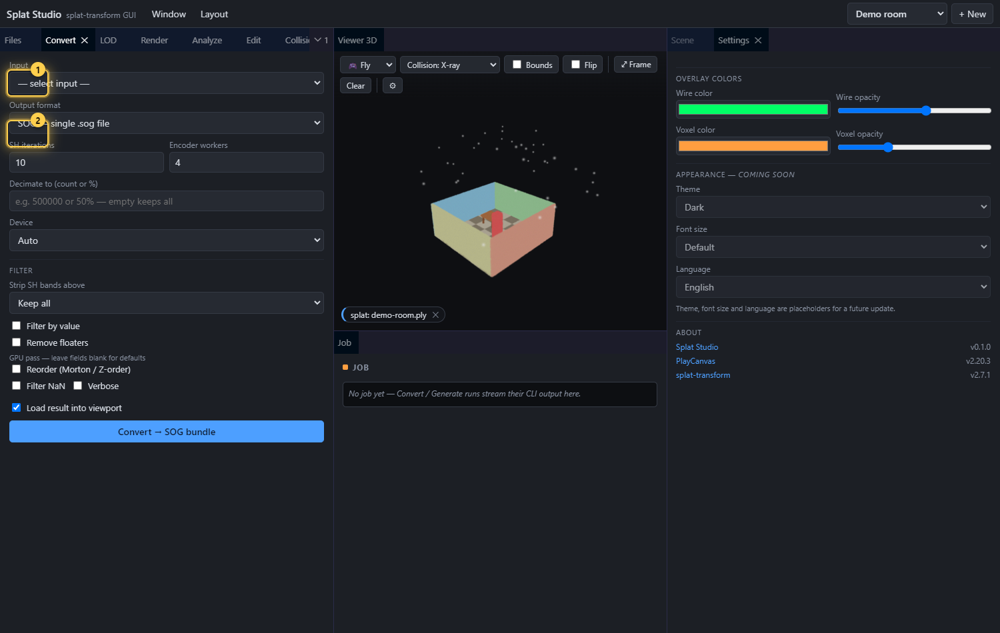

The Export panel produces an output file from a splat — one `splat-transform`
conversion as a background job. It handles **output formats** and **encode-time
filters**; spatial edits (transform, crop/carve) live in the
[Edit panel](#edit-transform-measure--region), streamed multi-LOD bakes in
the [LOD panel](#lod-streamed-multi-lod), and image renders in the
[Render panel](#render-webp-image).

1. **Input** — pick any source in the project (including formats the viewer can't
   display, like `.spz`/`.splat`/`.ksplat`/`.lcc`/`.lcc2`, and `.mjs` generators).
   For `.lcc`/`.lcc2` or a streamed-LOD `lod-meta.json` bundle (including one this
   app baked in the [LOD panel](#lod-streamed-multi-lod)), a **LOD levels** field
   appears to read back only a subset of levels (`--select-lod`, comma-separated,
   e.g. `0,1`; empty reads all).
2. **Output format** — choose the target:

   | Format | Notes |
   | --- | --- |
   | **SOG — single `.sog`** | Compressed single file (a ZIP of `meta.json` + WebP textures), ~95% smaller than PLY |
   | **SOG — unbundled folder** | `meta.json` + WebP textures, for streaming-friendly hosting |
   | **PLY** / **Compressed PLY** | Standard / SuperSplat-compressed point data |
   | **SPZ** | Niantic SPZ (pick container version 3 or 4) |
   | **GLB** | glTF binary with `KHR_gaussian_splatting` |
   | **CSV** | Raw gaussian data for analysis |
   | **HTML viewer** | Self-contained viewer page with the splat embedded |

3. Set format-specific options as they appear. For SOG-backed outputs that's a
   paired **SH iterations** / **Encoder workers** row — iterations trade quality
   for speed, while Encoder workers (`--max-workers`) only changes encode speed,
   not the output (`0` = serial). Other formats surface SPZ version, HTML viewer
   options, etc. Then click **Export**. The exact CLI command and live output appear
   in the **Job** panel. With **Load result into viewport** checked (default), any
   viewable result loads automatically when the job finishes.

## Generate: procedural .mjs generators

The **Generate** tab runs a procedural `.mjs` generator — a script that creates
gaussians from parameters instead of a scan (creation, not export, which is why it
has its own tab).

1. **Generator** — pick a `.mjs` file in the project (**+ sample generator** in
   Files drops one in).
2. **Params** — a freeform `key=val` field, or **live sliders** if the generator
   advertises a `params` schema (drag and release to regenerate).
3. **✨ Generate & view** — writes a `.ply` into the project and loads it straight
   into the viewport.

To export a generator to another format, pick the `.mjs` as the **Export** input —
the Generate tab's params apply to that run too.

### Filters

The **Filter** section applies encode-time filters to the splat before it's written.
They run in a fixed pipeline order (and don't apply to streamed-LOD bakes):

- **Strip SH bands above** — drop spherical-harmonic bands to shrink the file
  (`-H`, e.g. keep only band 0 for flat color).
- **Filter by value** — keep/drop by a property comparison (`-V`); pick the property,
  comparator, and threshold.
- **Remove floaters** — strip disconnected specks (`--filter-floaters`); a GPU pass with optional
  voxel size / opacity / min-contribution overrides.
- **Reorder (Morton / Z-order)** — spatially sort for better compression (`--morton-order`).
- **Decimate to (count or %)** — reduce the gaussian count to a number or percentage
  (`--decimate`).
- **Filter NaN** — drop non-finite gaussians (`-N`).
- **Verbose** — print memory/timing diagnostics in the job log (`--verbose --memory`).

---

## LOD: streamed multi-LOD

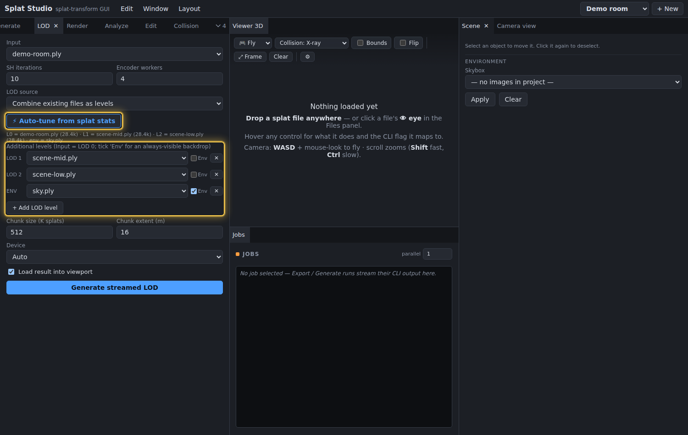

The LOD panel bakes a **streamed multi-LOD SOG** — a `lod-meta.json` plus per-LOD chunk
folders that the engine streams by camera distance, for scenes too big to load at once.

1. **Input** — the highest-detail source (LOD 0).
2. Set the paired **SH iterations** / **Encoder workers** row (as in Export).
3. **LOD source** — *Decimate input automatically* derives the lighter levels from the
   single input, or *Combine existing files as levels* uses files you already have
   (e.g. exports at different gaussian counts) as explicit levels.
4. In Decimate mode, set **LOD levels** and **Keep per level (%)**. In Combine mode,
   each **Additional level** row is the next, lighter level — order matters (each level
   should have fewer gaussians than the one before). Tick a row's **Env** box to make
   that file an always-visible far/background shell (a coarse, decimated backdrop —
   skybox, distant cityscape — emitted as LOD `-1`) the runtime keeps resident instead
   of culling it by distance. One environment layer per bake; Combine mode only.
5. Set the **Chunk size (K splats)** and **Chunk extent (m)**, pick a **Device**, then
   **Generate streamed LOD**.

Every bake also writes a `build-meta.json` next to the bundle's `lod-meta.json` — the
recipe it was built from: the source file per level, the environment selection, the
effective settings, and per-level gaussian counts. Expand the bundle's row in the Files
panel (its **▸** chevron, or **Details** in the **⋯** menu) to read the recipe inline
(bundles baked before this file existed report "No build recipe").

> **⚡ Auto-tune from splat stats:** the **Auto-tune** button reads each source's
> gaussian count and world-space extents (a quick CPU summary, cached) and fills the
> settings for you:
>
> - **Decimate** mode — derives the number of **LOD levels** and **chunk extent** from
>   the input's count and scene size (aiming the coarsest level near ~150k gaussians).
> - **Combine** mode — orders the level rows by gaussian count (most detail first →
>   LOD 1, 2, …) and tags a backdrop (much larger extents, or an `env`/`sky`-ish name)
>   as the **Env** layer. Warns if a level has more gaussians than the Input (LOD 0).
>
> A one-line plan summarises what it chose; every value stays editable afterwards.

---

## Render: WebP image

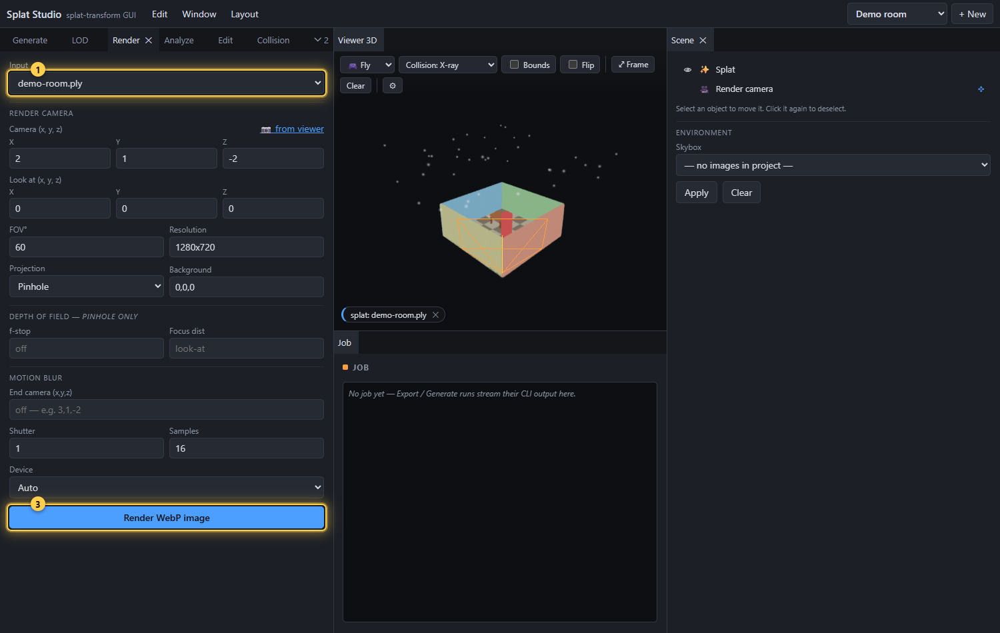

The Render panel GPU-renders a lossless **WebP image** of the splat through the
rasterizer.

1. Pick the **Input** splat.
2. Set the per-axis **Camera** and **Look at** fields — or click **📷 from viewer** to copy
   the current viewport camera as a starting point, then fine-tune by dragging the
   **Render camera** gizmo (select it in the [Scene panel](#scene-hierarchy)).
3. Set **FOV°**, **Resolution**, **Projection** (pinhole or equirect 360°), and a
   **Background** color.
4. Optionally add **Depth of field** (f-stop + focus distance, pinhole only) and
   **Motion blur** (an end camera pose + shutter / sample count).
5. Pick the **Device** and click **Render WebP image**.

The render camera is also previewed as a **frustum gizmo** in the viewport (and live in
the [Camera view](#camera-view) tab) so you can see exactly what it will capture.

---

## Analyze: summary statistics

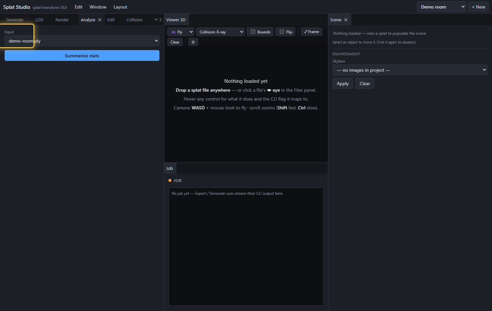

Analyze prints per-column statistics without writing any file (`--stats`).

1. Pick an **Input** and click **Summarize stats**.
2. The result renders below and persists: summary **tiles** (gaussian count, SH
   bands, etc.) and a **table** of per-column `min · max · median · mean · stdDev`
   with NaN/Inf counts.
3. **copy** puts the raw Markdown summary on the clipboard.

Use it to sanity-check a splat before converting — spot NaNs, extreme extents from
floaters, or unexpected SH bands.

---

## Edit: transform, measure & region

The Edit panel hosts the **spatial edits** — transform, measure-to-scale, set origin,
and region trim. Each writes a new edited splat and loads it; the source is untouched.
Most tools are viewport-driven: **you place points by clicking the splat**, and points
snap to the surface and hide behind it as you orbit (no collision mesh needed).

### Transform

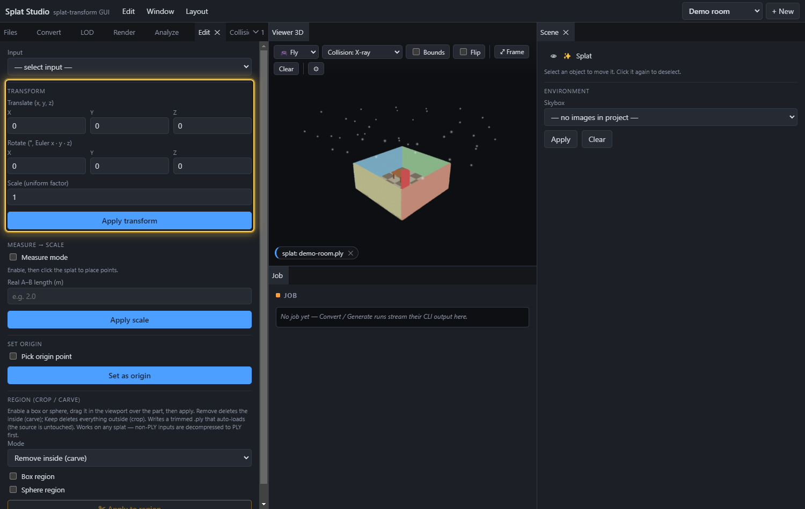

Apply a fixed translate / rotate / scale to the splat before writing:

- **Translate (x, y, z)** — move every gaussian (`-t`), in `splat-transform` world units.
- **Rotate (°, Euler x · y · z)** — rotate by Euler angles in degrees (`-r`).
- **Scale (uniform factor)** — uniformly scale (`-s`); `1` = no change, `0.5` = half,
  `2` = double.

Click **Apply transform** to write a new edited `.ply` that auto-loads.

### Measure → scale

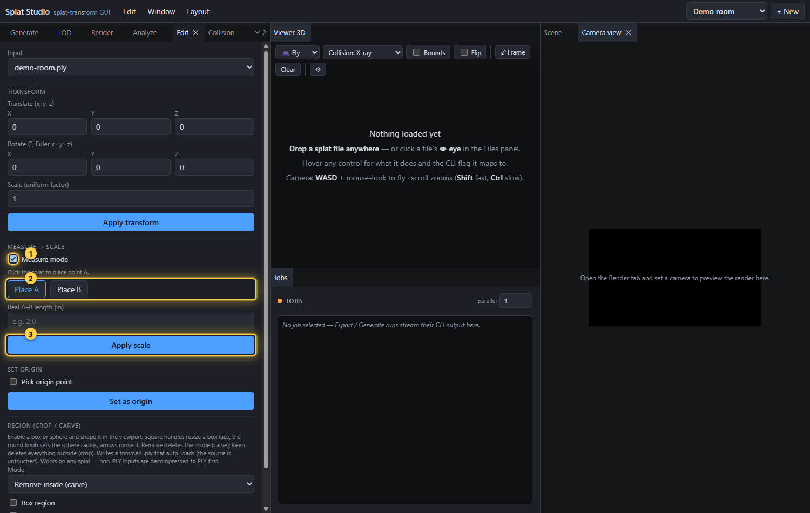

The measure tool turns the viewport into a measuring/aligning tool — like SuperSplat,
but local and driven by `splat-transform`.

**Measure → real-world scale:**

1. Pick the splat in **Input** (and show it with its **eye** so you can see it).
2. Check **Measure mode**.
3. **Click the splat** to drop point **A** (green), then click again for point **B**
   (orange) across a feature whose real size you know. **Place A / Place B** choose
   which point the next click sets, so you can nudge just one.
4. Enter the **Real A–B length** in meters. The readout shows the resulting scale
   factor.
5. Click **Apply scale** — Splat Studio writes a new, correctly-scaled splat (`-s`)
   and loads it.

### Set origin

Check **Pick origin point**, click the splat where `(0,0,0)` should be, then **Set as
origin** to recenter the splat (`-t`).

### Region (crop / carve)

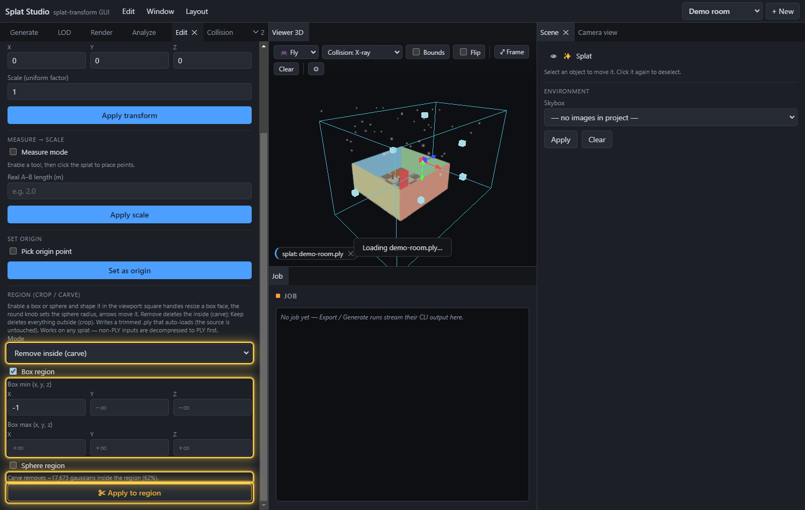

Trim the splat to (or away from) a box or sphere. A **Mode** dropdown picks what
*✂ Apply to region* does:

- **Remove inside (carve)** — deletes the gaussians *inside* the box/sphere.
- **Keep inside (crop)** — deletes everything *outside*, keeping only the inside.

Enable **Box region** and/or **Sphere region** and shape it in the viewport: drag a
**square face handle** to resize one side of the box (the opposite face stays pinned —
and only that side's field is filled in, so blank/unbounded sides stay unbounded), drag
the **round knob** on the sphere's edge to set its radius, and drag the **arrows** to
move the whole shape. A live readout shows how many gaussians the trim will remove;
then **✂ Apply to region**. It writes a new trimmed `.ply` that auto-loads; the source
is untouched. `splat-transform`'s `-B`/`-S` can only *keep* inside, so this runs a
local trim.

It works on **any single-file splat**, not just PLY: non-PLY inputs
(`.sog`/`.spz`/`.splat`/`.ksplat`/`.lcc`) are decompressed to a temp PLY via the CLI
first, then trimmed. The output is always a `.ply`.

---

## Collision: voxels & mesh

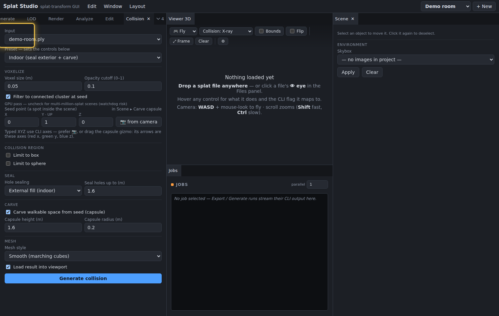

Generate a runtime collision mesh (`.collision.glb`) and sparse voxel octree
(`.voxel.json/.bin`) from a splat.

1. **Input** — the source splat.
2. **Preset** — a one-click starting point that fills in the controls below:
   - **Indoor** — seal the model from outside air, then carve the walkable interior.
   - **Outdoor** — fill each column up from the bottom so terrain is solid.
   - **Object** — plain voxelization, no sealing or carving.
   Editing any control switches the preset to **Custom**.
3. **Voxelize** — set the **voxel size** (edge length, e.g. 0.05 m) and **opacity
   cutoff** (ignore wispy gaussians).
4. **Seed point** — a spot *inside* the scene used by sealing, carving and the
   cluster filter. Type XYZ, or fly inside with WASD and click **📷 from camera**
   (recommended — typed axes are CLI-space, rotated 180° from the viewer). To see and
   drag the seed in the viewport, select **Carve capsule** in the
   [Scene panel](#scene-hierarchy).
5. **Collision region** *(optional)* — limit generation to part of a large scene.
   Tick **Limit to box** to crop the splat to an axis-aligned box (everything outside
   is ignored before voxelizing). An amber box appears in the viewport: drag a **square
   face handle** to resize (the opposite face stays put) or the **arrows** to move the
   whole box — no mode switching. The corner fields and the box stay in sync, so you
   can also type exact extents. **Limit to sphere** crops to a sphere instead — drag
   the **round knob** on its edge to set the radius, the arrows to move the centre.
   **Region face shading** tints the region's faces so you can see exactly where it
   cuts through the splat (0 = wireframe only). This is the fix when a big scene at a
   fine voxel size hits the
   **marching-cubes vertex limit** (`RangeError: Map maximum size exceeded`): cropping
   shrinks the mesh surface. A risk chip estimates the overflow risk and offers one-click
   **Coarsen voxel** / **Shrink to seed**; **Generate** asks for confirmation when the
   risk is high.
6. **Seal** — choose hole sealing (external fill for interiors, floor fill for
   terrain, or none) and the distance to seal over.
7. **Carve** — flood-fill walkable space from the seed with a player-sized capsule
   (height/radius). Select **Carve capsule** in the Scene panel to preview it in cyan
   and size it against the splat. Essential after external fill.
8. **Mesh style** — smooth (marching cubes) or exact voxel faces — then **Generate
   collision**. With **Load result into viewport** checked (default), the outputs load
   as a wireframe + voxel overlay when the job finishes.

> The **cluster filter** (keep only the splats connected to the seed) is GPU-only and
> can trip the Windows GPU watchdog on multi-million-gaussian scenes — uncheck it for
> very large scans.

---

## Viewport toolbar & Settings

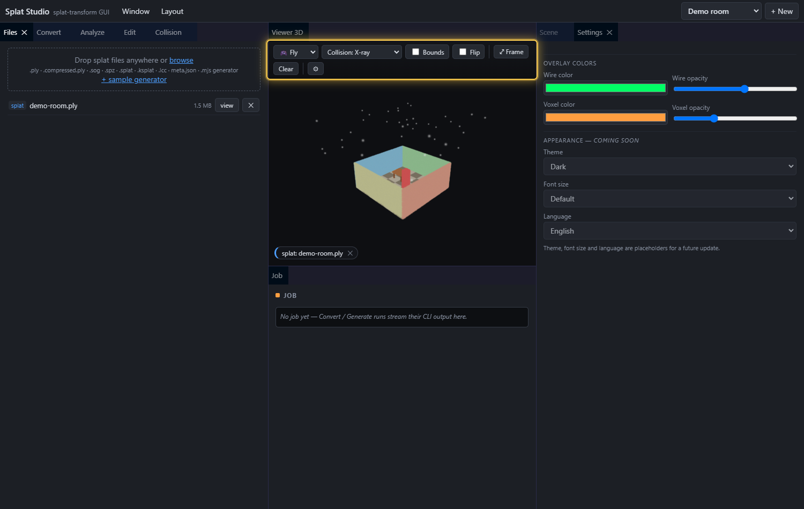

Display controls live in a **toolbar along the top of the Viewer 3D window**:

- **Camera control** — **Fly** (default): mouse-look + **WASD** to move, ideal for
  inspecting carved interiors. **Orbit**: drag to rotate around the focus point;
  middle- or Shift-drag pans. Scroll zooms in both modes.
- **Collision style** — *X-ray* (all edges through everything, for small meshes),
  *Hidden-line* (front edges only, for dense meshes), or *Solid + edges* (lit
  translucent surface — best for checking placement and inspecting carved interiors).
- **Bounds** — draws the splat's axis-aligned bounding box (floaters stretch it — a
  quick outlier check). **Flip** — for collision meshes from other tools already in
  viewer/engine space (splat-transform output is aligned automatically).
- **Frame** — re-fit the camera. **Clear** — unload everything and free GPU memory.
- **⚙** — opens the **Settings** dialog (also under **Window ▸ Settings…**).

Layer visibility (splat / collision / voxels) is toggled per-object with the **👁 eye
buttons in the [Scene panel](#scene-hierarchy)**.

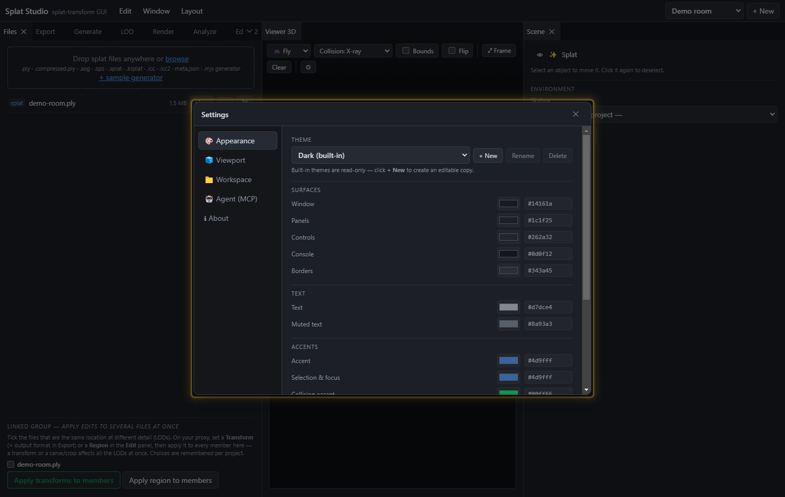

**Settings** opens as a dialog with sections down the left:

- **Appearance** — the app **theme**. **Dark** and **Light** are built in; **+ New**
  copies the selected theme into an editable one where every color is configurable
  live — surfaces, text, the **accent**, the **selection/focus** color, the panel
  hues and the status colors — each with a color picker + hex field. Custom themes
  can be renamed, deleted, or reset to their base palette, and everything is
  remembered between sessions.
- **Viewport** — the **wire / voxel colors & opacity** for the 3D overlays.
- **Workspace** — the folder whose subfolders are your projects.
- **Agent (MCP)** — agent control of the live editor (below).
- **Advanced** — a **scratch directory for large decimations** (`--scratch-dir`): where
  decimation spills temp files on very large scenes. Blank (the default) spills
  alongside the output; point it at another drive only if the output drive is low on
  space. Applies to Export **Decimate** runs and the decimated levels of **Streamed LOD**.
- **About** — component versions.

**Agent (MCP)** holds a single toggle that lets a connected AI agent drive the live
editor through Splat Studio's [MCP server](../README.md#mcp-server-ai-agent-control). It's **off by
default**, loopback-only, and revocable instantly (and it resets to off when you switch workspaces);
the headless pipeline tools work regardless. See [docs/MCP_SETUP.md](MCP_SETUP.md) for the full
setup and [docs/MCP_WORKFLOWS.md](MCP_WORKFLOWS.md) for step-by-step agent workflow tutorials.

---

## Scene hierarchy

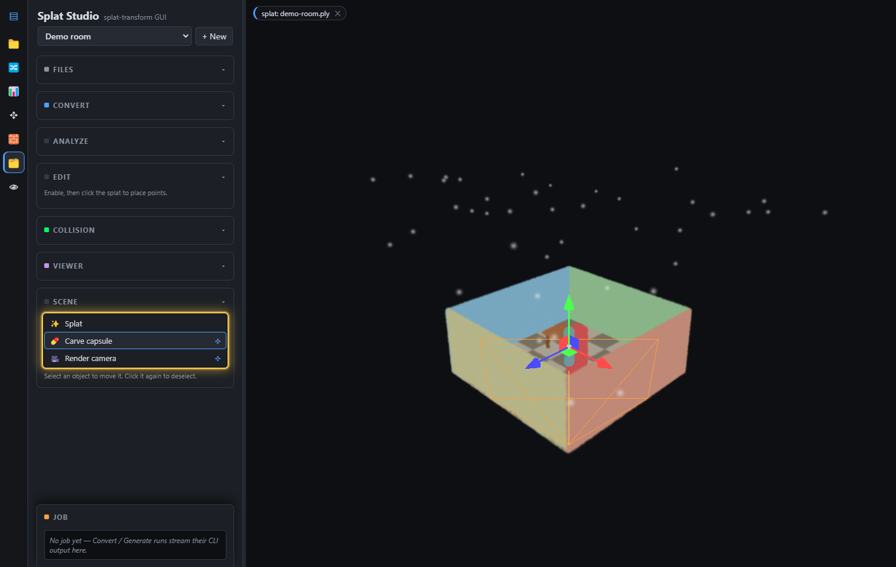

The **Scene** panel lists the objects currently in the viewport and lets you select
one to move it with a gizmo — **selecting nothing shows no gizmo**. Each layer has a
**👁 eye button** to show/hide it.

- **Splat / Collision mesh / Voxels** — appear once loaded; the 👁 toggles visibility,
  and selecting them just clears any active gizmo.
- **Carve capsule** (✥) — shows up only while you're actively setting up collision
  carving (the **Collision** tab is active **and** *Carve* is on). Select it to show
  the seed marker + carve capsule and a **translate gizmo**; drag to position the
  collision seed (the Collision panel's seed XYZ update live). Leaving the Collision
  tab or turning off carve removes it (and clears the selection).
- **Render camera** (✥) — appears only while a WebP render is set up. Select it to move
  the render camera with a gizmo; the **Move / Rotate** toggle switches between a
  translate and a rotate gizmo — dragging updates the WebP **Camera** / **Look-at**
  fields, the frustum preview follows, and the [Camera view](#camera-view) updates live.

**Environment / skybox:** at the bottom of the panel, pick an equirectangular panorama
image (`.webp/.jpg/.png/.hdr`) from the project and click **Apply** to use it as the
scene skybox; **Clear** removes it.

---

## Camera view

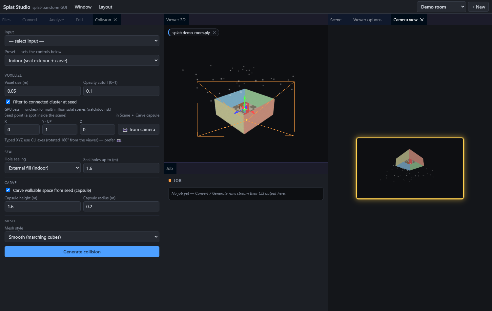

Open **Camera view** from the **Window** menu to see a **live preview of exactly what
the WebP render camera sees** — rendered from a second camera, so it shows the splat
without the gizmos/frustum/markers. It's a normal dock tab: drag it anywhere, resize
it, or float it. Move the render camera (via its gizmo or the WebP fields) and the
preview follows. It's only active in **WebP image** output mode (otherwise it shows a
hint); closing the tab frees its GPU memory.

---

## The 3D viewport

- **Fly** (default) — mouse-look + WASD · **Orbit** (toolbar) — left-drag ·
  **Pan** — middle-drag (orbit) · **Zoom** — scroll (Shift fast, Ctrl slow).
- The **chips** at the top-left show what's currently displayed (splat / collision /
  voxels); each **✕** removes that layer.
- Drag the **borders** between dock tabs to resize, or drag a **tab** to re-dock or
  float it. Closed a tab by accident? Reopen it from the **Window** menu.

## Coordinate notes

- The viewer renders splats with the usual 180°-about-X flip of raw (Y-down) 3DGS
  data. Edit-panel measurements are in real viewer/world units.
- `splat-transform`'s voxel/collision pipeline uses a different up-axis convention,
  so **typed** seed/translate coordinates are in CLI space (rotated 180° about Y from
  the viewer). Prefer **📷 from camera** / clicking the splat, which convert for you.
- **Gizmo arrows show the typed axes.** The seed, crop, and collision-region gizmos
  run in local space, so their arrows point along the same axes as the panel fields:
  **red = x, green = y, blue = z**. If you're ever unsure which way a typed value
  moves something, look at the arrows.

---

## Updates

Every push to the project's `main` branch builds a new Windows release (installer +
portable exe) and publishes it to
[GitHub Releases](https://github.com/CodeByKeegan/splat-studio/releases). See
[AUTOMATION.md](AUTOMATION.md) for the release pipeline.

The installed app **updates itself**: on launch (and every few hours) it checks for a
newer release. With **Download updates automatically** on (Settings ▸ Updates, the
default), a found update starts downloading right away; turned off, the status pill in
the bottom-right corner (and the settings page) show a **Download** button instead.
The pill tracks the whole flow — checking, download progress, "restart to update" —
and clicking it opens Settings ▸ Updates. Downloads run in the background (progress
also shows on the taskbar icon); when ready the app offers to **restart and install**,
or installs automatically the next time you quit. You can trigger a check any time via
**Help → Check for Updates…** or the settings page. (The NSIS installer build
self-updates; the standalone portable exe does not.)

---

*Maintaining this guide is automated — see [AUTOMATION.md](AUTOMATION.md). When the
app or its upstreams change, the screenshots and this page are regenerated so they
never drift from the shipping UI.*
