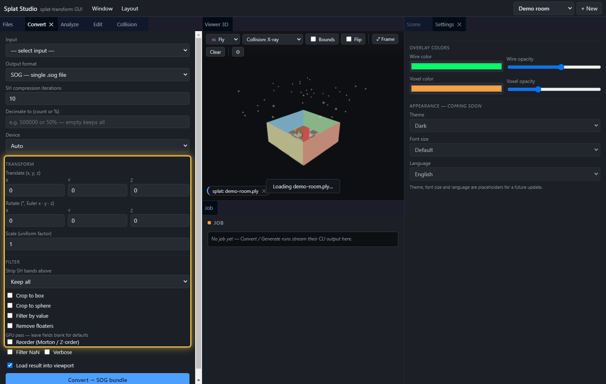
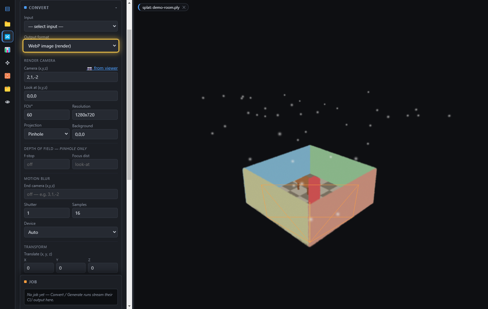

# Splat Studio — User Guide

A complete walkthrough of everything Splat Studio can do. Splat Studio is a local
desktop GUI for [`@playcanvas/splat-transform`](https://github.com/playcanvas/splat-transform):
convert gaussian-splat formats, bundle SOG, render images, generate collision
meshes, and edit splats — all with a live PlayCanvas 3D viewport.

> The screenshots below are generated automatically from the running app against the
> built-in **demo room** splat (`npm run docs:capture`), so they always match the
> current UI. The highlight boxes mark the controls each step refers to.

## Contents
- [The interface](#the-interface)
- [Projects & files](#projects--files)
- [Convert: formats & rendering](#convert-formats--rendering)
  - [Transforms & filters](#transforms--filters)
  - [WebP image render](#webp-image-render)
- [Analyze: summary statistics](#analyze-summary-statistics)
- [Edit: measure-to-scale & set origin](#edit-measure-to-scale--set-origin)
- [Collision: voxels & mesh](#collision-voxels--mesh)
- [Viewport toolbar & Settings](#viewport-toolbar--settings)
- [Scene hierarchy](#scene-hierarchy)
- [Camera view](#camera-view)
- [The 3D viewport](#the-3d-viewport)
- [Coordinate notes](#coordinate-notes)
- [Updates](#updates)

---

## The interface

Splat Studio is a **dockable tab editor** (think Unity/Unreal). Every panel and the
3D viewport is a tab you can **drag to re-dock, resize, float, close, and reopen**.

- **Top menu bar** — the app title, the **Window** and **Layout** menus, and the
  project picker.
- **Dock** — the default layout puts the panel tabs (Files, Convert, Analyze, Edit,
  Collision) on the left, the **3D viewport** in the center, the **Job** panel
  (live `splat-transform` output) below it, and **Scene** / **Settings** on the
  right. Drag any tab to rearrange; drag a tab out to float it in its own window.
- **Viewport** — the live 3D view, with a [toolbar](#viewport-toolbar--settings) along
  its top. The default camera is **fly** (mouse-look + WASD); right-drag pans, scroll
  zooms. Switch to orbit from the toolbar.

Every control has a tooltip — hover to see what it does and which CLI flag it maps to.

### Top menu

- **Window** — lists every panel with a checkmark for the ones that are open. Click to
  **reopen a closed panel** or close an open one. (The 3D **Viewer** and **Job** tabs
  can't be closed.)
- **Layout** — **Reset to default** restores the standard arrangement; **Save layout**
  checkpoints the current one. The layout is **saved per workspace**, so each workspace
  remembers its own arrangement.

The top bar holds (1) the app title, (2) the menus, and (3) the project picker.

---

## Projects & files

A **project** is a folder in your workspace; the dropdown in the top bar
switches between them, and **+ New** creates one. Everything is scoped to the
active project.

To add splats:

1. **Drop** files anywhere in the window, or click **browse**. Supported inputs:
   `.ply`, `.compressed.ply`, `.sog`, `.spz`, `.splat`, `.ksplat`, `.lcc`, `.lcc2`,
   `meta.json`, and `.mjs` generators.
2. The **file list** shows every source in the project. Click **view** to display a
   splat (or collision mesh / voxel octree) in the viewport, or **✕** to delete it.
3. **Right-click any file** — or click its **⋯** button — for an actions menu of
   everything you can do with that file. The menu adapts to the file's type:

   

   - **View in viewport**
   - **Convert → SOG bundle** / **Convert → Streamed LOD** / **Convert (other formats)…**
     — jumps to the Convert panel with the file selected and the format preset.
   - **Generate / Regenerate collision…** — jumps to the Collision panel (the label
     tells you whether a collision mesh already sits next to the file).
   - **Analyze stats** — runs the summary and shows the stats card.
   - **Edit (scale / origin)…**, **Generate & view** (`.mjs` generators),
     **Copy file path**, and **Delete**.
4. **+ sample generator** drops a ready-to-run `.mjs` scene generator into the
   project so you can try the generator workflow immediately.

---

## Convert: formats & rendering

The Convert panel runs one `splat-transform` conversion as a background job.

1. **Input** — pick any source in the project (including formats the viewer can't
   display, like `.spz`/`.splat`/`.ksplat`/`.lcc`/`.lcc2`, and `.mjs` generators).
2. **Output format** — choose the target:

   | Format | Notes |
   | --- | --- |
   | **SOG — single `.sog`** | Compressed single file (a ZIP of `meta.json` + WebP textures), ~95% smaller than PLY |
   | **SOG — unbundled folder** | `meta.json` + WebP textures, for streaming-friendly hosting |
   | **SOG — streamed LOD folder** | `lod-meta.json` + per-LOD chunks; the engine streams by camera distance (big scenes) |
   | **PLY** / **Compressed PLY** | Standard / SuperSplat-compressed point data |
   | **SPZ** | Niantic SPZ (pick container version 3 or 4) |
   | **GLB** | glTF binary with `KHR_gaussian_splatting` |
   | **CSV** | Raw gaussian data for analysis |
   | **HTML viewer** | Self-contained viewer page with the splat embedded |
   | **WebP image (render)** | A rendered image of the splat — see [below](#webp-image-render) |

3. Set format-specific options as they appear. For SOG-backed outputs that's a
   paired **SH iterations** / **Encoder workers** row — iterations trade quality
   for speed, while Encoder workers (`--max-workers`) only changes encode speed,
   not the output (`0` = serial). Other formats surface SPZ version, LOD levels,
   etc. Then click **Convert**. The exact CLI command
   and live output appear in the **Job** panel. With **Load result into viewport**
   checked (default), any viewable result loads automatically when the job finishes.

> **Environment backdrop (streamed LOD):** in **Combine** mode each added row is a
> streamed detail level (LOD 1, 2, …). Tick a row's **Env** box to designate that
> file as an always-visible backdrop — a coarse, decimated far-field shell (skybox,
> distant cityscape, forest) the runtime keeps resident at negligible budget cost
> instead of culling it by camera distance (emitted as `<file> -l -1`). Use it only
> for the distant static surround; anything the viewer walks up to should be a
> numbered level. One environment layer per bake; not available in Decimate mode.

> **⚡ Auto-tune from splat stats (streamed LOD):** when the output format is
> **streamed LOD**, an **Auto-tune** button reads each source's gaussian count and
> world-space extents (a quick CPU `-m` summary, cached) and fills the settings for you:
>
> 
>
> - **Combine** mode — orders the level rows by gaussian count (most detail first →
>   LOD 1, 2, …) and tags a backdrop (much larger extents, or an `env`/`sky`-ish name)
>   as the **Env** layer. Warns if a level has more gaussians than the Input (LOD 0).
> - **Decimate** mode — derives the number of **LOD levels** and **chunk extent** from
>   the input's count and scene size (aiming the coarsest level near ~150k gaussians).
>
> A one-line plan summarises what it chose; every value stays editable afterwards.

> **Generators:** when the input is a `.mjs` file, a **Generator params** field (and,
> if the generator advertises a schema, live sliders) appear. **✨ Generate & view**
> runs the generator and loads the result straight into the viewport.

### Transforms & filters

Below the format options, the **Transform** and **Filter** sections apply a fixed
pipeline to the splat before it's written (they don't apply to streamed-LOD bakes):

- **Translate / Rotate / Scale** — move (`-t`), rotate in Euler degrees (`-r`), and
  uniformly scale (`-s`). The viewport previews the transform live as you type.
- **Strip SH bands above** — drop spherical-harmonic bands to shrink the file
  (`-H`, e.g. keep only band 0 for flat color).
- **Crop to box / sphere** — keep only gaussians inside a region (`-B` / `-S`); the
  region draws as a draggable wireframe in the viewport. (To *remove* a region instead,
  see **Carve** in the [Edit panel](#edit-measure-to-scale--set-origin).)
- **Filter by value** — keep/drop by a column comparison (`-V`).
- **Remove floaters** — strip disconnected specks (`-G`).
- **Reorder (Morton / Z-order)** — spatially sort for better compression (`-M`).
- **Filter NaN** — drop non-finite gaussians (`-N`).
- **Decimate to** — reduce the gaussian count to a number or percentage (`-F`).
- **Verbose** — print memory/timing diagnostics in the job log.

### WebP image render

Choosing **WebP image (render)** turns the panel into a camera: it GPU-renders a
lossless image of the splat.

1. Set **Camera** and **Look at** positions — or click **⮌ from viewer** to copy the
   current viewport camera as a starting point.
2. Set **FOV**, **Resolution**, **Projection** (pinhole or equirectangular), and a
   **Background** color.
3. Optionally add **Depth of field** (f-stop + focus distance) and **Motion blur**
   (an end camera pose + shutter/sample count).
4. Pick the **Device** (GPU adapter or CPU) and click **Convert** to render.

The WebP camera is also previewed as a **frustum gizmo** in the viewport so you can
see exactly what it will capture.

---

## Analyze: summary statistics

Analyze prints per-column statistics without writing any file (`-m/--summary`).

1. Pick an **Input** and click **Summarize stats**.
2. The result renders below and persists: summary **tiles** (gaussian count, SH
   bands, etc.) and a **table** of per-column `min · max · median · mean · stdDev`
   with NaN/Inf counts.
3. **copy** puts the raw Markdown summary on the clipboard.

Use it to sanity-check a splat before converting — spot NaNs, extreme extents from
floaters, or unexpected SH bands.

---

## Edit: measure-to-scale & set origin

The Edit panel turns the viewport into a measuring/aligning tool — like SuperSplat,
but local and driven by `splat-transform`. **You place points by clicking the splat;**
points snap to the surface and hide behind it as you orbit (no collision mesh needed).

**Scale directly:** enter a **Scale factor** (e.g. `2` for twice as large, `0.5` for
half) and click **Apply scale** — it runs `-s` on the splat and loads the result. No
measuring required.

**Measure → real-world scale:**

1. Pick the splat in **Input** (and **view** it so you can see it).
2. Check **Measure mode**.
3. **Click the splat** to drop point **A** (green), then click again for point **B**
   (orange) across a feature whose real size you know. **Place A / Place B** choose
   which point the next click sets, so you can nudge just one.
4. Enter the **Real A–B length** in meters. The readout shows the resulting scale
   factor.
5. Click **Apply scale** — Splat Studio writes a new, correctly-scaled splat (`-s`)
   and loads it.

**Set origin:** check **Pick origin point**, click the splat where `(0,0,0)` should
be, then **Set as origin** to recenter the splat (`-t`).

**✂ Carve out region (remove inside):** delete the gaussians inside a box or sphere —
the inverse of cropping. Enable **Box region** and/or **Sphere region**, drag the
wireframe in the viewport over the part to remove (a live readout shows how many
gaussians the carve will delete), then **Carve out region**. It writes a new trimmed
`.ply` that loads into the viewport; the source is untouched. `splat-transform`'s
`-B`/`-S` can only *keep* inside, so this runs a local trim. PLY sources only.

---

## Collision: voxels & mesh

Generate a runtime collision mesh (`.collision.glb`) and sparse voxel octree
(`.voxel.json/.bin`) from a splat.

1. **Input** — the source splat.
2. **Preset** — a one-click starting point that fills in the controls below:
   - **Indoor** — seal the model from outside air, then carve the walkable interior.
   - **Outdoor** — fill each column up from the bottom so terrain is solid.
   - **Object** — plain voxelization, no sealing or carving.
   Editing any control switches the preset to **Custom**.
3. **Voxelize** — set the **voxel size** (edge length, e.g. 0.05 m) and **opacity
   cutoff** (ignore wispy gaussians).
4. **Seed point** — a spot *inside* the scene used by sealing, carving and the
   cluster filter. Type XYZ, or fly inside with WASD and click **📷 from camera**
   (recommended — typed axes are CLI-space, rotated 180° from the viewer). To see and
   drag the seed in the viewport, select **Carve capsule** in the
   [Scene panel](#scene-hierarchy).
5. **Collision region** *(optional)* — limit generation to part of a large scene.
   Tick **Limit to box** to crop the splat to an axis-aligned box (everything outside
   is ignored before voxelizing). Select **Collision region** in the
   [Scene panel](#scene-hierarchy) to get a draggable amber box in the viewport, with a
   **Move / Resize** toggle: *Move* drags the whole box, *Resize* shows a handle on each
   face — drag one and the opposite face stays put. The corner fields and the box stay
   in sync, so you can also type exact extents. **Limit to sphere** crops to a sphere
   instead. This is the fix when a big scene at a fine voxel size hits the
   **marching-cubes vertex limit** (`RangeError: Map maximum size exceeded`): cropping
   shrinks the mesh surface. A risk chip estimates the overflow risk and offers one-click
   **Coarsen voxel** / **Shrink to seed**; **Generate** asks for confirmation when the
   risk is high.
6. **Seal** — choose hole sealing (external fill for interiors, floor fill for
   terrain, or none) and the distance to seal over.
7. **Carve** — flood-fill walkable space from the seed with a player-sized capsule
   (height/radius). Select **Carve capsule** in the Scene panel to preview it in cyan
   and size it against the splat. Essential after external fill.
8. **Mesh style** — smooth (marching cubes) or exact voxel faces — then **Generate
   collision**. With **Load result into viewport** checked (default), the outputs load
   as a wireframe + voxel overlay when the job finishes.

> The **cluster filter** (keep only the splats connected to the seed) is GPU-only and
> can trip the Windows GPU watchdog on multi-million-gaussian scenes — uncheck it for
> very large scans.

---

## Viewport toolbar & Settings

Display controls live in a **toolbar along the top of the Viewer 3D window**:

- **Camera control** — **Fly** (default): mouse-look + **WASD** to move, ideal for
  inspecting carved interiors. **Orbit**: drag to rotate around the focus point.
  Right-drag pans and scroll zooms in both.
- **Collision style** — *X-ray* (all edges through everything, for small meshes),
  *Hidden-line* (front edges only, for dense meshes), or *Solid + edges* (lit
  translucent surface — best for checking placement and inspecting carved interiors).
- **Bounds** — draws the splat's axis-aligned bounding box (floaters stretch it — a
  quick outlier check). **Flip** — for collision meshes from other tools already in
  viewer/engine space (splat-transform output is aligned automatically).
- **Frame** — re-fit the camera. **Clear** — unload everything and free GPU memory.
- **⚙** — opens the **Settings** tab.

Layer visibility (splat / collision / voxels) is toggled per-object with the **👁 eye
buttons in the [Scene panel](#scene-hierarchy)**.

The **Settings** window holds the **wire / voxel colors & opacity** for the overlays.
Appearance options (theme, font size, language) are placeholders for a future update.

---

## Scene hierarchy

The **Scene** panel lists the objects currently in the viewport and lets you select
one to move it with a gizmo — **selecting nothing shows no gizmo**. Each layer has a
**👁 eye button** to show/hide it.

- **Splat / Collision mesh / Voxels** — appear once loaded; the 👁 toggles visibility,
  and selecting them just clears any active gizmo.
- **Carve capsule** (✥) — shows up only while you're actively setting up collision
  carving (the **Collision** tab is active **and** *Carve* is on). Select it to show
  the seed marker + carve capsule and a **translate gizmo**; drag to position the
  collision seed (the Collision panel's seed XYZ update live). Leaving the Collision
  tab or turning off carve removes it (and clears the selection).
- **Render camera** (✥) — appears only while a WebP render is set up. Select it to move
  the render camera with a gizmo; the **Move / Rotate** toggle switches between a
  translate and a rotate gizmo — dragging updates the WebP **Camera** / **Look-at**
  fields, the frustum preview follows, and the [Camera view](#camera-view) updates live.

**Environment / skybox:** at the bottom of the panel, pick an equirectangular panorama
image (`.webp/.jpg/.png/.hdr`) from the project and click **Apply** to use it as the
scene skybox; **Clear** removes it.

---

## Camera view

Open **Camera view** from the **Window** menu to see a **live preview of exactly what
the WebP render camera sees** — rendered from a second camera, so it shows the splat
without the gizmos/frustum/markers. It's a normal dock tab: drag it anywhere, resize
it, or float it. Move the render camera (via its gizmo or the WebP fields) and the
preview follows. It's only active in **WebP image** output mode (otherwise it shows a
hint); closing the tab frees its GPU memory.

---

## The 3D viewport

- **Fly** (default) — mouse-look + WASD · **Orbit** (toolbar) — left-drag ·
  **Pan** — right-drag · **Zoom** — scroll.
- The **chips** at the top-left show what's currently displayed (splat / collision /
  voxels); each **✕** removes that layer.
- Drag the **borders** between dock tabs to resize, or drag a **tab** to re-dock or
  float it. Closed a tab by accident? Reopen it from the **Window** menu.

## Coordinate notes

- The viewer renders splats with the usual 180°-about-X flip of raw (Y-down) 3DGS
  data. Edit-panel measurements are in real viewer/world units.
- `splat-transform`'s voxel/collision pipeline uses a different up-axis convention,
  so **typed** seed/translate coordinates are in CLI space (rotated 180° about Y from
  the viewer). Prefer **📷 from camera** / clicking the splat, which convert for you.

---

## Updates

Every push to the project's `main` branch builds a new Windows release (installer +
portable exe) and publishes it to
[GitHub Releases](https://github.com/CodeByKeegan/splat-studio/releases). The
installed app checks for a newer release on launch and, if one exists, offers to open
the downloads page — or check any time via **Help → Check for Updates…**. See
[AUTOMATION.md](AUTOMATION.md) for the release pipeline.

---

*Maintaining this guide is automated — see [AUTOMATION.md](AUTOMATION.md). When the
app or its upstreams change, the screenshots and this page are regenerated so they
never drift from the shipping UI.*
