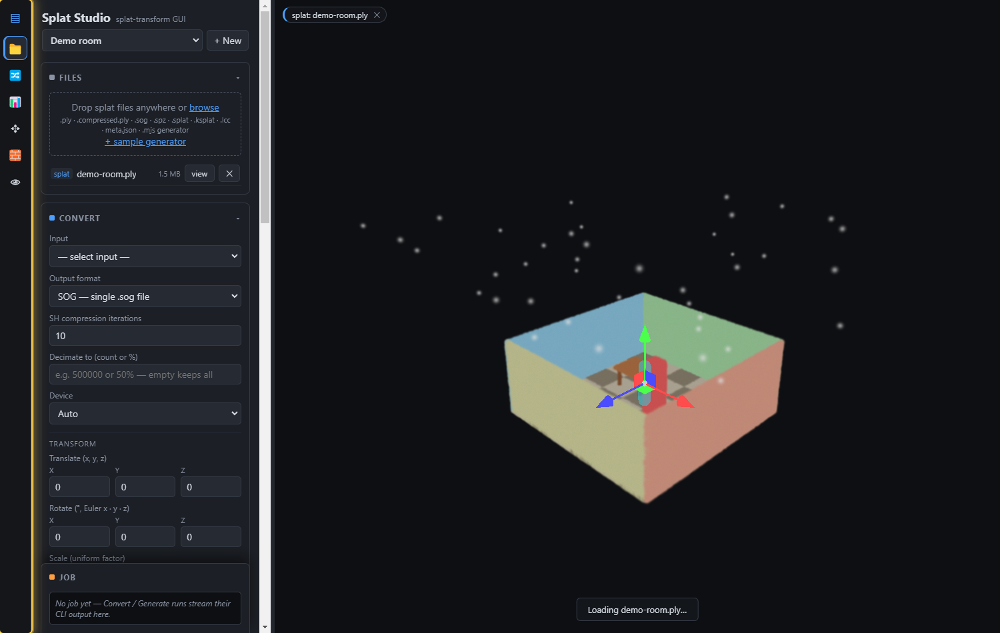
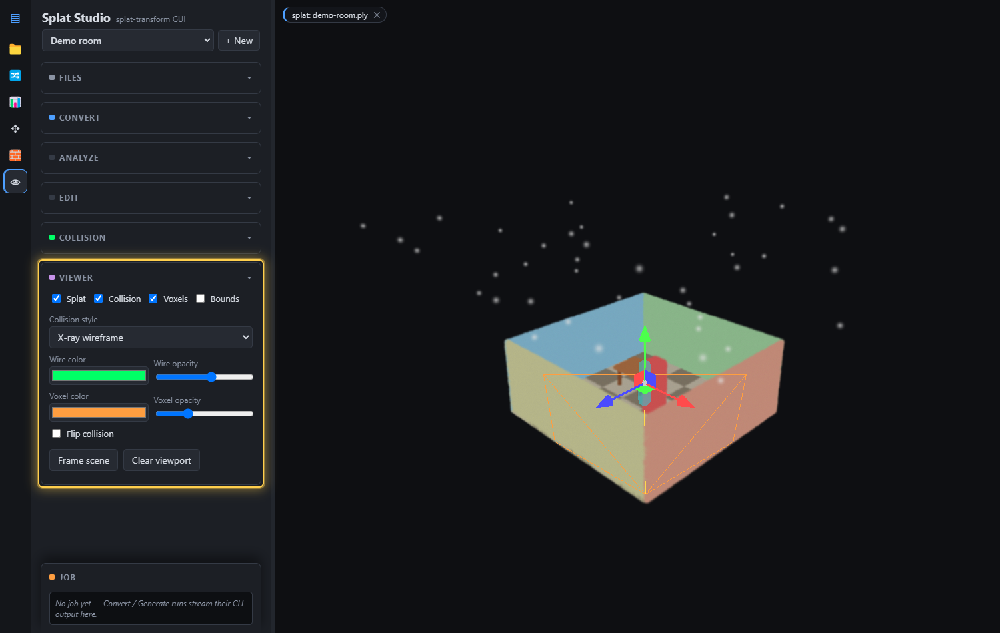

# Splat Studio — User Guide

A complete walkthrough of everything Splat Studio can do. Splat Studio is a local
desktop GUI for [`@playcanvas/splat-transform`](https://github.com/playcanvas/splat-transform):
convert gaussian-splat formats, bundle SOG, render images, generate collision
meshes, and edit splats — all with a live PlayCanvas 3D viewport.

> The screenshots below are generated automatically from the running app against the
> built-in **demo room** splat (`npm run docs:capture`), so they always match the
> current UI. The highlight boxes mark the controls each step refers to.

## Contents
- [The interface](#the-interface)
- [Projects & files](#projects--files)
- [Convert: formats & rendering](#convert-formats--rendering)
  - [Transforms & filters](#transforms--filters)
  - [WebP image render](#webp-image-render)
- [Analyze: summary statistics](#analyze-summary-statistics)
- [Edit: measure-to-scale & set origin](#edit-measure-to-scale--set-origin)
- [Collision: voxels & mesh](#collision-voxels--mesh)
- [Viewer options](#viewer-options)
- [The 3D viewport](#the-3d-viewport)
- [Coordinate notes](#coordinate-notes)

---

## The interface

Three regions:

1. **Icon rail** (far left) — switches the active panel and maximizes the viewport.
2. **Sidebar** — the active panel's controls, with a pinned **Job** panel at the
   bottom that streams the running `splat-transform` command and its output.
3. **Viewport** (right) — the live 3D view. Drag to orbit, right-drag to pan,
   scroll to zoom, and **W A S D** to fly (handy for inspecting carved interiors).

### Icon rail

Each button opens one panel (Files, Convert, Analyze, Edit, Collision, Viewer) and
collapses the others. The top **▤** button hides the whole sidebar to give the 3D
view the full window — click it again to bring the panels back. Every control in
the app has a tooltip; hover to see what it does and which CLI flag it maps to.

---

## Projects & files

A **project** is a folder in your workspace; the dropdown at the top of the sidebar
switches between them, and **+ New** creates one. Everything below is scoped to the
active project.

To add splats:

1. **Drop** files anywhere in the window, or click **browse**. Supported inputs:
   `.ply`, `.compressed.ply`, `.sog`, `.spz`, `.splat`, `.ksplat`, `.lcc`,
   `meta.json`, and `.mjs` generators.
2. The **file list** shows every source in the project. Click **view** to display a
   splat (or collision mesh / voxel octree) in the viewport, or **✕** to delete it.
3. **+ sample generator** drops a ready-to-run `.mjs` scene generator into the
   project so you can try the generator workflow immediately.

---

## Convert: formats & rendering

The Convert panel runs one `splat-transform` conversion as a background job.

1. **Input** — pick any source in the project (including formats the viewer can't
   display, like `.spz`/`.splat`/`.ksplat`/`.lcc`, and `.mjs` generators).
2. **Output format** — choose the target:

   | Format | Notes |
   | --- | --- |
   | **SOG — single `.sog`** | Compressed single file (a ZIP of `meta.json` + WebP textures), ~95% smaller than PLY |
   | **SOG — unbundled folder** | `meta.json` + WebP textures, for streaming-friendly hosting |
   | **SOG — streamed LOD folder** | `lod-meta.json` + per-LOD chunks; the engine streams by camera distance (big scenes) |
   | **PLY** / **Compressed PLY** | Standard / SuperSplat-compressed point data |
   | **SPZ** | Niantic SPZ (pick container version 3 or 4) |
   | **GLB** | glTF binary with `KHR_gaussian_splatting` |
   | **CSV** | Raw gaussian data for analysis |
   | **HTML viewer** | Self-contained viewer page with the splat embedded |
   | **WebP image (render)** | A rendered image of the splat — see [below](#webp-image-render) |

3. Set format-specific options as they appear (SH compression iterations for SOG,
   SPZ version, LOD levels, etc.), then click **Convert**. The exact CLI command
   and live output appear in the **Job** panel, and any viewable result auto-loads.

> **Generators:** when the input is a `.mjs` file, a **Generator params** field (and,
> if the generator advertises a schema, live sliders) appear. **✨ Generate & view**
> runs the generator and loads the result straight into the viewport.

### Transforms & filters

Below the format options, the **Transform** and **Filter** sections apply a fixed
pipeline to the splat before it's written (they don't apply to streamed-LOD bakes):

- **Translate / Rotate / Scale** — move (`-t`), rotate in Euler degrees (`-r`), and
  uniformly scale (`-s`). The viewport previews the transform live as you type.
- **Strip SH bands above** — drop spherical-harmonic bands to shrink the file
  (`-H`, e.g. keep only band 0 for flat color).
- **Crop to box / sphere** — keep only gaussians inside a region (`-B` / `-S`); the
  region draws as a draggable wireframe in the viewport.
- **Filter by value** — keep/drop by a column comparison (`-V`).
- **Remove floaters** — strip disconnected specks (`-G`).
- **Reorder (Morton / Z-order)** — spatially sort for better compression (`-M`).
- **Filter NaN** — drop non-finite gaussians (`-N`).
- **Decimate to** — reduce the gaussian count to a number or percentage (`-F`).
- **Verbose** — print memory/timing diagnostics in the job log.

### WebP image render

Choosing **WebP image (render)** turns the panel into a camera: it GPU-renders a
lossless image of the splat.

1. Set **Camera** and **Look at** positions — or click **⮌ from viewer** to copy the
   current viewport camera as a starting point.
2. Set **FOV**, **Resolution**, **Projection** (pinhole or equirectangular), and a
   **Background** color.
3. Optionally add **Depth of field** (f-stop + focus distance) and **Motion blur**
   (an end camera pose + shutter/sample count).
4. Pick the **Device** (GPU adapter or CPU) and click **Convert** to render.

The WebP camera is also previewed as a **frustum gizmo** in the viewport so you can
see exactly what it will capture.

---

## Analyze: summary statistics

Analyze prints per-column statistics without writing any file (`-m/--summary`).

1. Pick an **Input** and click **Summarize stats**.
2. The result renders below and persists: summary **tiles** (gaussian count, SH
   bands, etc.) and a **table** of per-column `min · max · median · mean · stdDev`
   with NaN/Inf counts.
3. **copy** puts the raw Markdown summary on the clipboard.

Use it to sanity-check a splat before converting — spot NaNs, extreme extents from
floaters, or unexpected SH bands.

---

## Edit: measure-to-scale & set origin

The Edit panel turns the viewport into a measuring/aligning tool — like SuperSplat,
but local and driven by `splat-transform`. **You place points by clicking the splat;**
points snap to the surface and hide behind it as you orbit (no collision mesh needed).

**Measure → real-world scale:**

1. Pick the splat in **Input** (and **view** it so you can see it).
2. Check **Measure mode**.
3. **Click the splat** to drop point **A** (green), then click again for point **B**
   (orange) across a feature whose real size you know. **Place A / Place B** choose
   which point the next click sets, so you can nudge just one.
4. Enter the **Real A–B length** in meters. The readout shows the resulting scale
   factor.
5. Click **Apply scale** — Splat Studio writes a new, correctly-scaled splat (`-s`)
   and loads it.

**Set origin:** check **Pick origin point**, click the splat where `(0,0,0)` should
be, then **Set as origin** to recenter the splat (`-t`).

---

## Collision: voxels & mesh

Generate a runtime collision mesh (`.collision.glb`) and sparse voxel octree
(`.voxel.json/.bin`) from a splat.

1. **Input** — the source splat.
2. **Preset** — a one-click starting point that fills in the controls below:
   - **Indoor** — seal the model from outside air, then carve the walkable interior.
   - **Outdoor** — fill each column up from the bottom so terrain is solid.
   - **Object** — plain voxelization, no sealing or carving.
   Editing any control switches the preset to **Custom**.
3. **Voxelize** — set the **voxel size** (edge length, e.g. 0.05 m) and **opacity
   cutoff** (ignore wispy gaussians).
4. **Seed point** — a spot *inside* the scene used by sealing, carving and the
   cluster filter. Type XYZ, or fly inside with WASD and click **📷 from camera**
   (recommended — typed axes are CLI-space, rotated 180° from the viewer). The seed
   shows as a yellow marker in the viewport.
5. **Seal** — choose hole sealing (external fill for interiors, floor fill for
   terrain, or none) and the distance to seal over.
6. **Carve** — flood-fill walkable space from the seed with a player-sized capsule
   (height/radius). The capsule previews in cyan in the viewport so you can size it
   against the splat. Essential after external fill.
7. **Mesh style** — smooth (marching cubes) or exact voxel faces — then **Generate
   collision**. Outputs auto-load as a wireframe overlay.

> The **cluster filter** (keep only the splats connected to the seed) is GPU-only and
> can trip the Windows GPU watchdog on multi-million-gaussian scenes — uncheck it for
> very large scans.

---

## Viewer options

Display controls for the 3D view:

- **Splat / Collision / Voxels / Bounds** — toggle each layer. **Bounds** draws the
  splat's axis-aligned bounding box (floaters stretch it — a quick outlier check).
- **Collision style** — *X-ray* (all edges through everything, for small meshes),
  *Hidden-line* (front edges only, for dense meshes), or *Solid + edges* (lit
  translucent surface — best for checking placement and inspecting carved interiors).
- **Wire / Voxel color & opacity** — recolor the overlays.
- **Flip collision** — check this for collision meshes from other tools that are
  already in viewer/engine space (splat-transform output is aligned automatically).
- **Frame scene** — re-fit the camera. **Clear viewport** — unload everything and
  free GPU memory.

---

## The 3D viewport

- **Orbit** — left-drag · **Pan** — right-drag · **Zoom** — scroll · **Fly** — WASD.
- The **chips** at the top-left show what's currently displayed (splat / collision /
  voxels); each **✕** removes that layer.
- Drag the **divider** between the sidebar and viewport to resize, or use the icon
  rail's **▤** to hide the sidebar entirely.

## Coordinate notes

- The viewer renders splats with the usual 180°-about-X flip of raw (Y-down) 3DGS
  data. Edit-panel measurements are in real viewer/world units.
- `splat-transform`'s voxel/collision pipeline uses a different up-axis convention,
  so **typed** seed/translate coordinates are in CLI space (rotated 180° about Y from
  the viewer). Prefer **📷 from camera** / clicking the splat, which convert for you.

---

*Maintaining this guide is automated — see [AUTOMATION.md](AUTOMATION.md). When the
app or its upstreams change, the screenshots and this page are regenerated so they
never drift from the shipping UI.*
